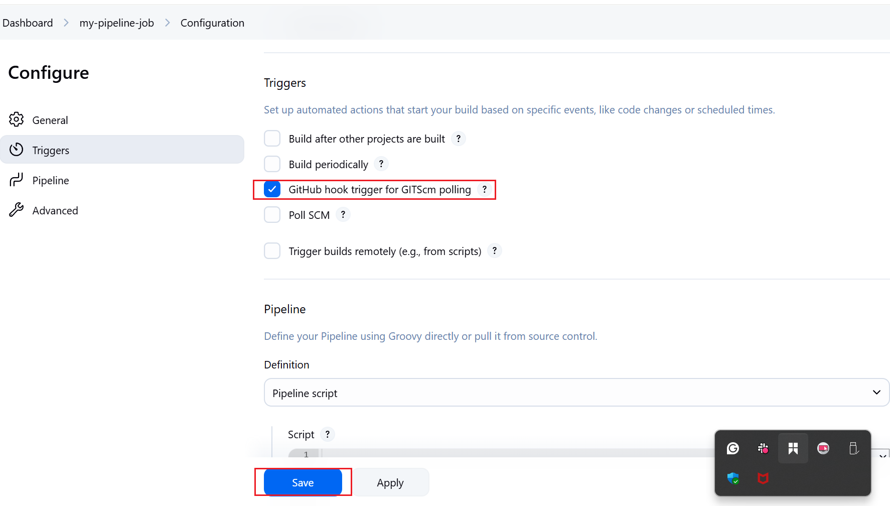

# JENKINS PIPELINE JOB

## OBJECTIVES 

1. Automate Code Checkout:
Configure Jenkins to automatically pull the latest code from a GitHub repository.

2. Build Docker Image:
Use Jenkins to build a Docker image from a provided Dockerfile.

3. Run Docker Container:
Automatically start a Docker container from the built image and expose the required port.

4. Serve a Web Page:
Ensure the container serves a sample HTML file that can be accessed via a web browser.

5. Pipeline as Code:
Implement the entire workflow using a Jenkinsfile (Pipeline as Code) stored in version control.

6. Credential Management:
Securely manage and use credentials for accessing private repositories or Docker registries.

>> WHAT IS  A JENKINS PIPELINE JOB ?

A Jenkins Pipeline Job is a way to automate a series of steps (like building, testing, and deploying code) in Jenkins using a script called a Jenkinsfile.
It lets you define your entire build and deployment process as code, so Jenkins can run it automatically every time you make changes to your project.

>> CREATING A PIPELINE JOB

The following steps illustrates how a Jenkins pipeline job is created.

* Clicked on new item on the jenkins dashboard menu

* Created a pipeline job and named it "My pipeline Job"

>> CONFIGURED THE BUILD TRIGGER

* Clicked configure on my pipeline job and then added these configurations 

* Clicked on build trigger to configure the build triggering from Github webhook

* Created a Github Webhook

>> Wrote the Jenkins Pipeline script

What is a Jenkins pipeline script? A Jenkins Pipeline script is a set of instructions written in Groovy syntax (usually in a file called Jenkinsfile) that tells Jenkins exactly how to build, test, and deploy your application.
It defines the steps and stages of your automation process, so Jenkins can run them automatically whenever you update your code.

>> Below is the pipeline script

pipeline {
    agent any

    stages {
        stage('Connect to GitHub') {
            steps {
                checkout scmGit(
                    branches: [[name: '*/main']],
                    extensions: [],
                    userRemoteConfigs: [[
                        credentialsId: '86b7afca-b969-47ef-9401-59012d947367',
                        url: 'https://github.com/Techytobii/Darey.io-Projects.git'
                    ]]
                )
            }
        }

        stage('Debug Workspace') {
            steps {
                bat 'dir /s'
            }
        }

        stage('Build Docker Image') {
            steps {
                script {
                    bat '''
                        docker build -t myapp:latest ^
                        -f 05.introduction-to-jenkins/5.2-jenkins-pipeline-job/Dockerfile ^
                        05.introduction-to-jenkins/5.2-jenkins-pipeline-job
                    '''
                }
            }
        }

        stage('Run Docker Container') {
            steps {
                script {
                    bat 'docker run -itd -p 8085:80 myapp:latest'
                }
            }
        }
    }
}

>> Explanation of the Jenkins Pipeline script

1. Agent any: Runs the pipeline on any available Jenkins agent.

2. Stage('Connect to GitHub'):
Checks out the latest code from the specified GitHub repository using provided credentials.

3. Stage('Debug Workspace'):
Lists all files and directories in the workspace (for debugging and verification).

4. Stage('Build Docker Image'):
Builds a Docker image named myapp:latest using the specified Dockerfile and build context.

5. Stage('Run Docker Container'):
Runs a new Docker container from the built image, mapping port 8085 on the host to port 80 in the container

>>> Copied the Jenkins pipeline script and pasted it in the section below

>> Generated Syntax for the Github repository in the steps below.

* Clicked on the pipeline syntax

* Selected the drop down menu and chose "Checkout: Checkout from version contol"

* Pasted my Repository Url and made sure branch selected is "main"

* Generated the pipeline script

* Now that the script has been generated I replaced it with connect jenkins in our pipeline script earlie

>> Installing Docker

Before Jenkins can run Docker commands, Docker needs to be installed on the same instance Jenkins was installed.

* Created a file named docker.sh

*  Pasted the script below into it 

sudo apt-get update -y
sudo apt-get install ca-certificates curl gnupg
sudo install -m 0755 -d /etc/apt/keyrings
curl -fsSL https://download.docker.com/linux/ubuntu/gpg | sudo gpg --dearmor -o /etc/apt/keyrings/docker.gpg
sudo chmod a+r /etc/apt/keyrings/docker.gpg

# Add the repository to Apt sources:
echo \
  "deb [arch=$(dpkg --print-architecture) signed-by=/etc/apt/keyrings/docker.gpg] https://download.docker.com/linux/ubuntu \
  $(. /etc/os-release && echo "$VERSION_CODENAME") stable" | \
  sudo tee /etc/apt/sources.list.d/docker.list > /dev/null
sudo apt-get update -y
sudo apt-get install docker-ce docker-ce-cli containerd.io docker-buildx-plugin docker-compose-plugin -y
sudo systemctl status docker

* Saved and closed the file

* Made the file executable using the chmod +x docker.sh command 

* Executed the docker.sh file

* Docker was successfully isntalled

* Docker running

>> Building The Pipeline script

* Created a new file named "dockerfile"

* Pasted the code below into the dockerfile

# Use the official NGINX base image
FROM nginx:alpine

# Set the working directory in the container
WORKDIR  /usr/share/nginx/html/

# Copy the local HTML file to the NGINX default public directory
COPY index.html /usr/share/nginx/html/

# Expose port 80 to allow external access
EXPOSE 80

* Created an HTML file named index.html and pasted the snippet below into it

"Congratulations, You have successfully run your first pipeline code."

>> Pushed the files and jenkins automatically ran a new build 

* To access the content of the "index.html" file, the inbound security group of my instance was edited and then opened the port mapped in the container.

>> After saving this configuration settings, we can now access our html file on our web browser

