# 📄 IMPLEMENTING CONTINOUS INTEGRATIPON

## 📘 **CI/CD Pipeline for Node.js Application with GitHub Actions, Docker, and AWS EC2**

---

## 🎯 Objectives

* Automate build, test, lint, and deployment for a Node.js application.
* Ensure code quality with ESLint, Prettier, and SonarCloud.
* Containerize application using Docker and publish to GHCR (GitHub Container Registry).
* Deploy automatically to AWS EC2 instance upon each push to `main` branch.

---

## 🪜 Prerequisites

✅ GitHub account & repository
✅ AWS account with:

* Running EC2 instance (Ubuntu)
* Security group with HTTP (80) & SSH (22) access
  ✅ SSH key pair for EC2
  ✅ Docker installed & running on EC2
  ✅ SonarCloud account for static code analysis
  ✅ GitHub Secrets configured:
  \| Secret Name      | Description                |
  \|-------------------|----------------------------|
  \| `EC2_HOST`        | Public IP of EC2 instance |
  \| `EC2_SSH_KEY`     | Private SSH key           |
  \| `GHCR_PAT`        | Personal Access Token for GHCR |
  \| `SONAR_TOKEN`     | SonarCloud token          |

---

## 🔗 Tools & Technologies

| Tool                  | Purpose                     |
| --------------------- | --------------------------- |
| **Node.js + Express** | Web application server      |
| **GitHub Actions**    | CI/CD orchestration         |
| **Docker & GHCR**     | Containerization & Registry |
| **AWS EC2**           | Deployment target           |
| **ESLint + Prettier** | Code quality & formatting   |
| **SonarCloud**        | Static code analysis        |
| **Jest + Supertest**  | Unit & integration tests    |

---

## 🏗️ Architecture & Workflow

```text
Developer → GitHub Repo → GitHub Actions → Build → Lint/Test → SonarCloud → Docker → GHCR → EC2
```

### Pipeline Diagram:


>> * 🖼️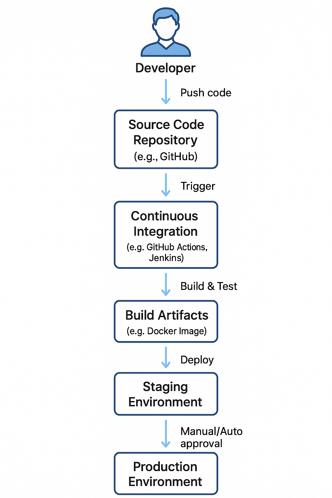

---

## 🧪 Project Setup

### 1️⃣ Creatd the repo

>> * 🖼️


### 2️⃣ Clone the Repo

```bash
git clone https://github.com/Techytobii/introduction-to-ci-cd.git
cd introduction-to-ci-cd
```

>> * 🖼️


### 3️⃣ Install Dependencies

```bash
npm install
```

>> * 🖼️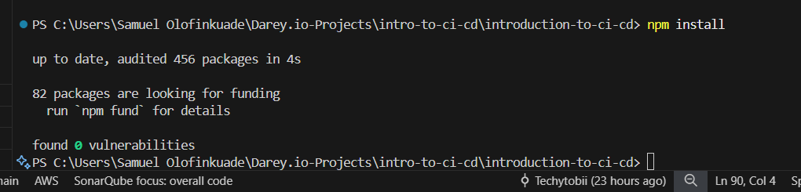


### 4️⃣ Lint & Format Code

```bash
npm run lint
npm run format
```

>> * 🖼️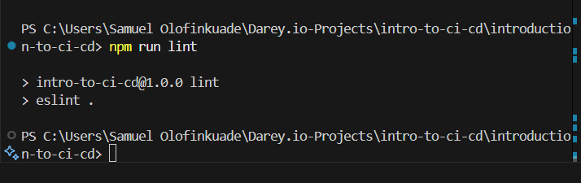

>> * 🖼️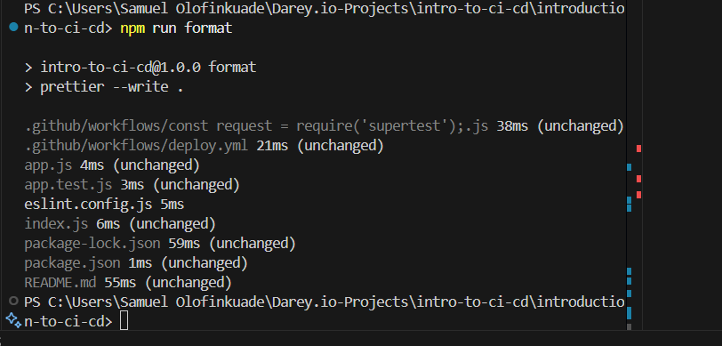


### 5️⃣ Tests

```bash
npm test
```

>> * 🖼️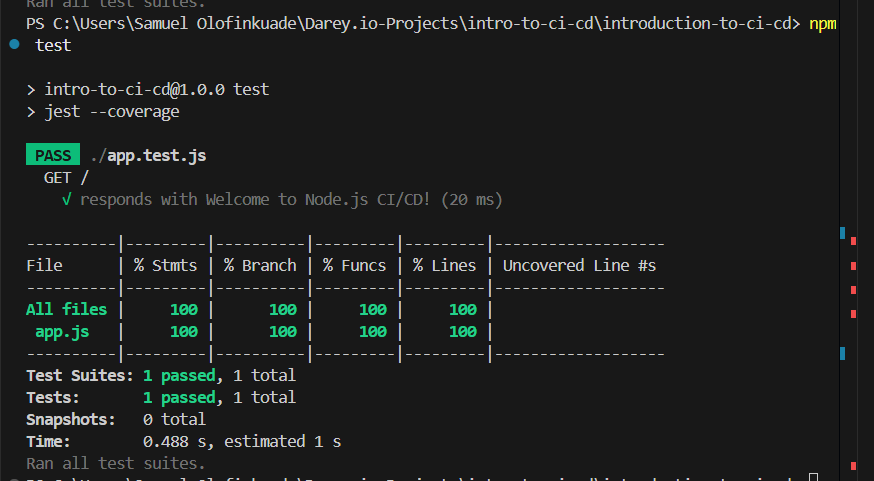


### 5️⃣ Run Locally

```bash
npm start
```
>> * 🖼️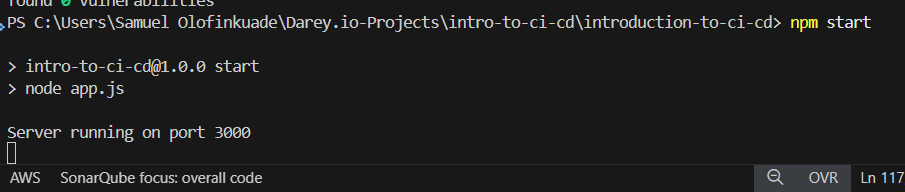


 Visited:  
---


## 🚀 CI/CD Pipeline

### Trigger:

Push to `main` branch.

### Jobs:

| Job                | Actions                             |
| ------------------ | ----------------------------------- |
| **lint-and-sonar** | Run ESLint, Run SonarCloud Scan     |
| **build-and-push** | Build Docker image & Push to GHCR   |
| **deploy**         | SSH into EC2, Pull & restart Docker |

---

### GitHub Actions Workflow

```yaml
on:
  push:
    branches: [main]

jobs:
  lint-and-sonar:
    …
  build-and-push:
    …
  deploy:
    …
```


>> * 🖼️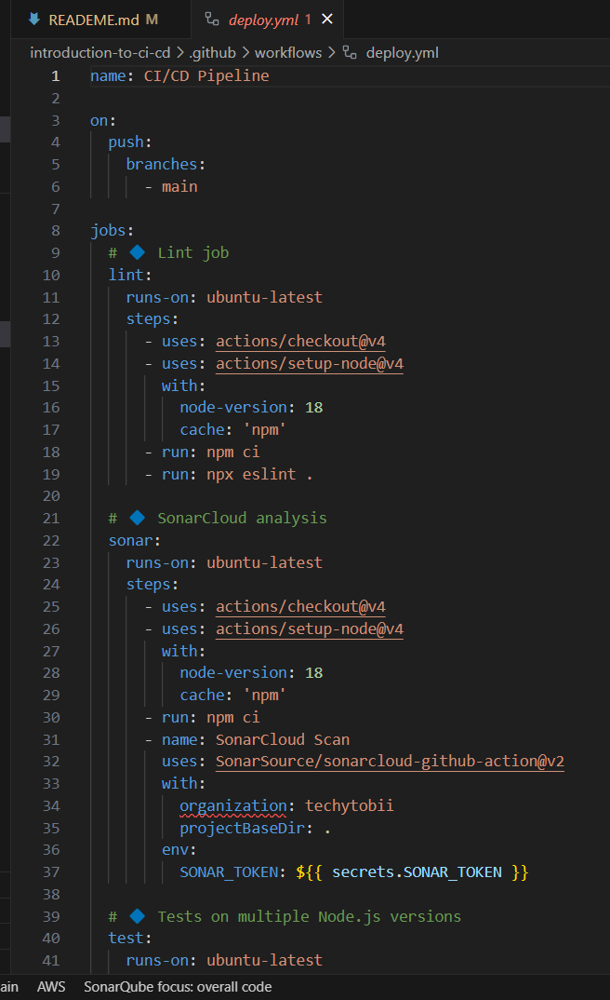

---


## 📦 Docker

### Build & Run Locally:

```bash
docker build -t intro-to-ci-cd .
docker run -d -p 3000:3000 intro-to-ci-cd
```

>> * 🖼️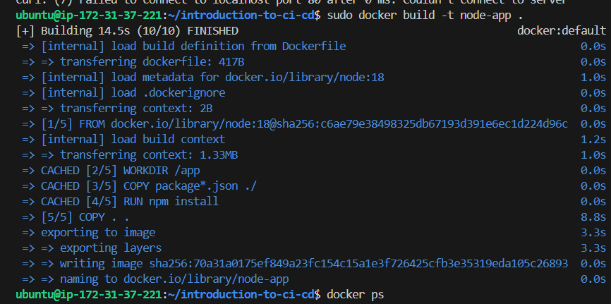


>> * 🖼️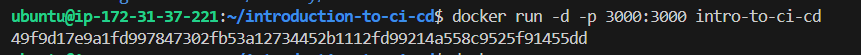


---

## 🖥️ Deployment

* Deployment is automatic through the pipeline.
* EC2 runs the containerized app on port `80`.
* Check deployment:

```bash
ssh ubuntu@<EC2_IP>
docker ps
```

>> * 🖼️


>> * 🖼️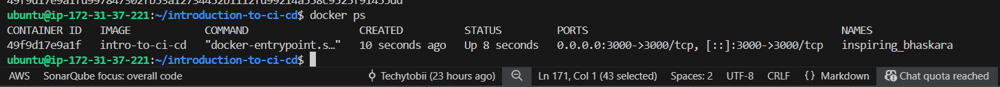
---


## 🧹 Tests

Unit & integration tests written with **Jest + Supertest**.
Test file: `__tests__/app.test.js`

```js
const request = require("supertest");
const app = require("../app");

describe("GET /", () => {
  it("should respond with 200 OK", async () => {
    const res = await request(app).get("/");
    expect(res.statusCode).toBe(200);
  });
});
```

Run tests:

```bash
npm test
```

>> * 🖼️


---

## 🚧 Challenges Faced

* 🔄 Dealing with `require is not defined in ES modules` error.
* 🔐 Setting up GitHub secrets properly.
* ⏳ EC2 SSH timeout in GitHub Actions.
* 🐳 Cleaning up old Docker containers on EC2.
* 🎯 Ensuring ESLint & Prettier work together without conflicts.

---

## 🌟 Lessons Learned

* Setting up secure CI/CD pipelines with GitHub Actions.
* Using SonarCloud for advanced code analysis.
* Managing Docker images and deployments on cloud infrastructure.
* Importance of properly configuring `package.json` (`type: module` vs CommonJS).

---

## 📸 Screenshots


| Screenshot Description            | Screenshot                           |
| --------------------------------- | ------------------------------------ |
| GitHub Actions Workflow Passing   | 🖼️ 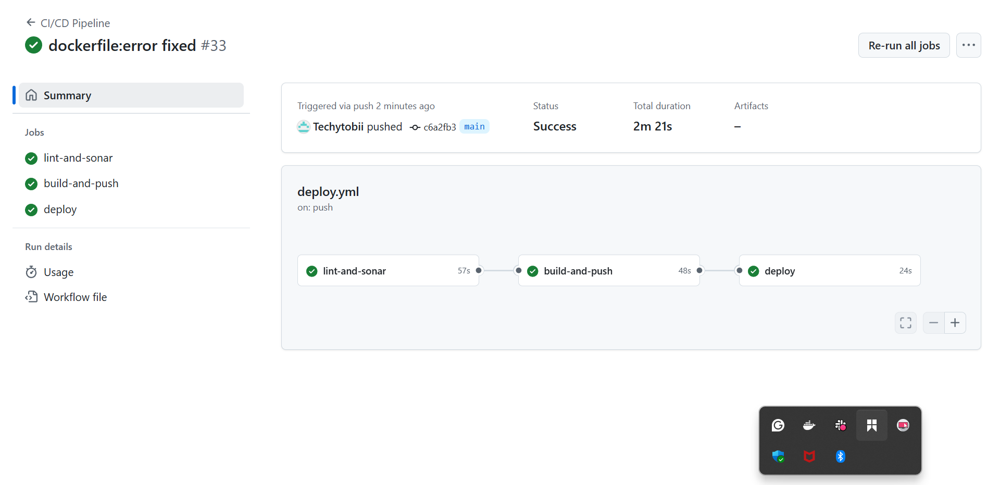 |
| App Running in Browser (EC2)      | 🖼️ 
| ESLint & Prettier Running Locally | 🖼️ 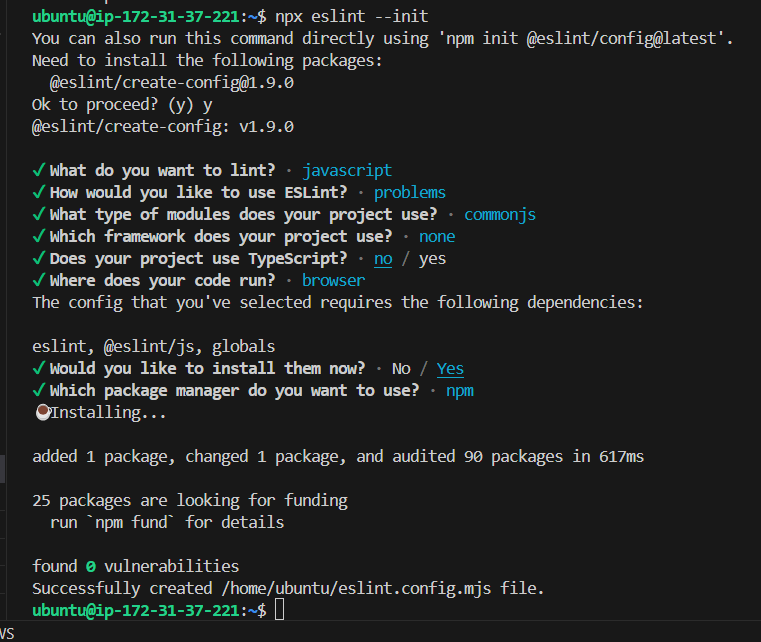      |
| Tests Running                     | 🖼️ 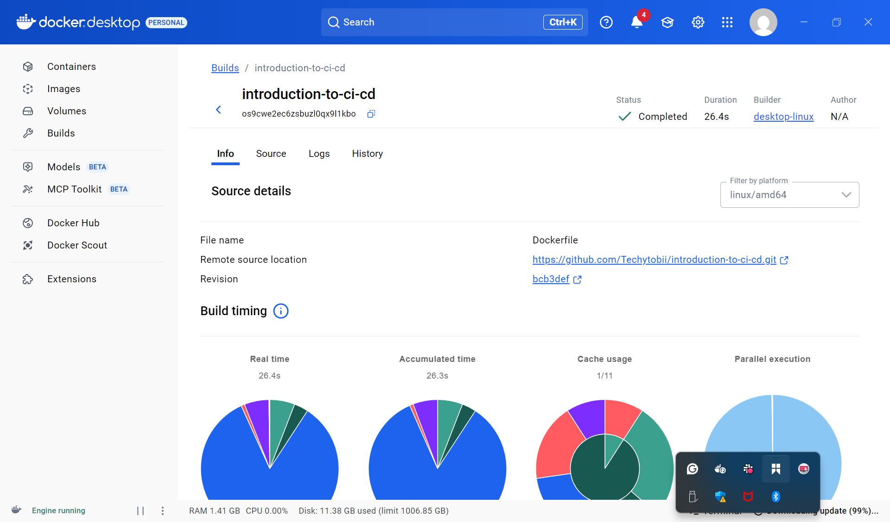     | 
| Sonar Cloud | 🖼️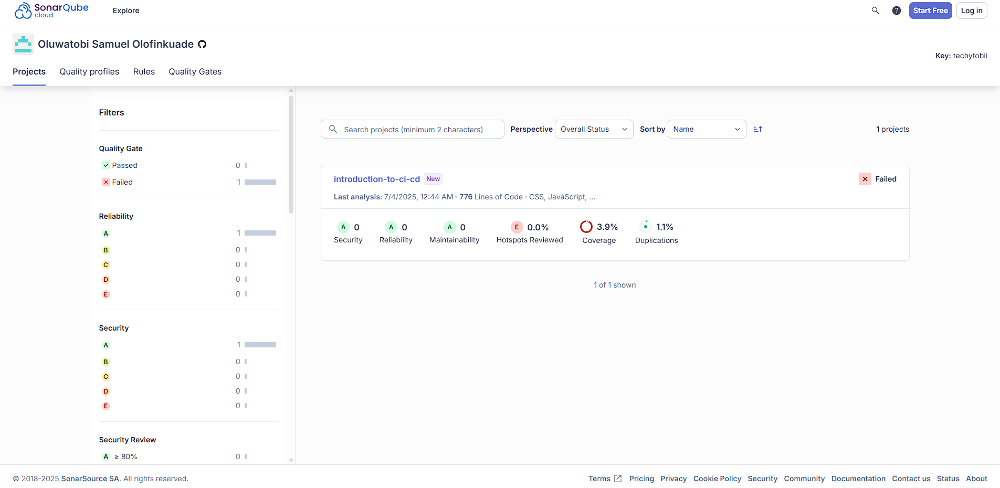
---

## 🙏 Author

**Samuel Oluwatobi Olofinkuade**
📧 [oluwatobi.olofinkuade933@gmail.com](mailto:oluwatobi.olofinkuade933@gmail.com)
📞 +2349071090064
🌐 [GitHub](https://github.com/Techytobii)

---

## 📚 References

* [GitHub Actions Documentation](https://docs.github.com/en/actions)
* [Docker Documentation](https://docs.docker.com/)
* [SonarCloud](https://sonarcloud.io/)
* [ESLint](https://eslint.org/)
* [Prettier](https://prettier.io/)
* [Jest](https://jestjs.io/)

---