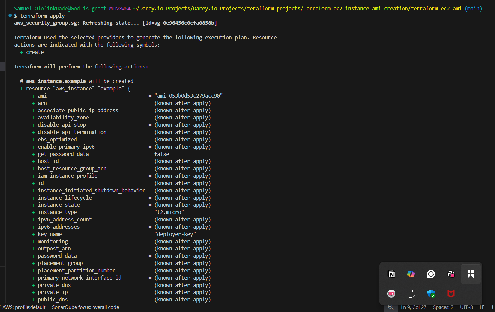
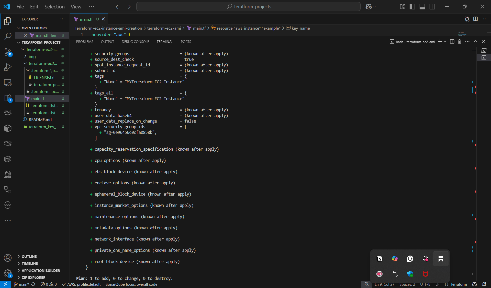
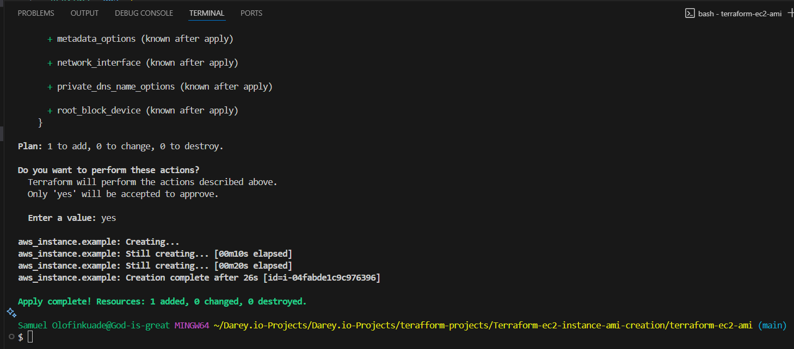
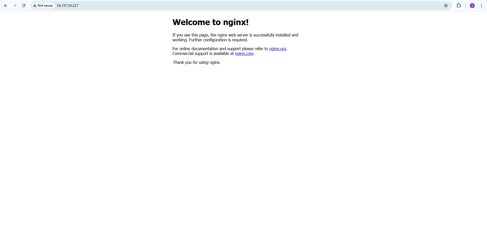
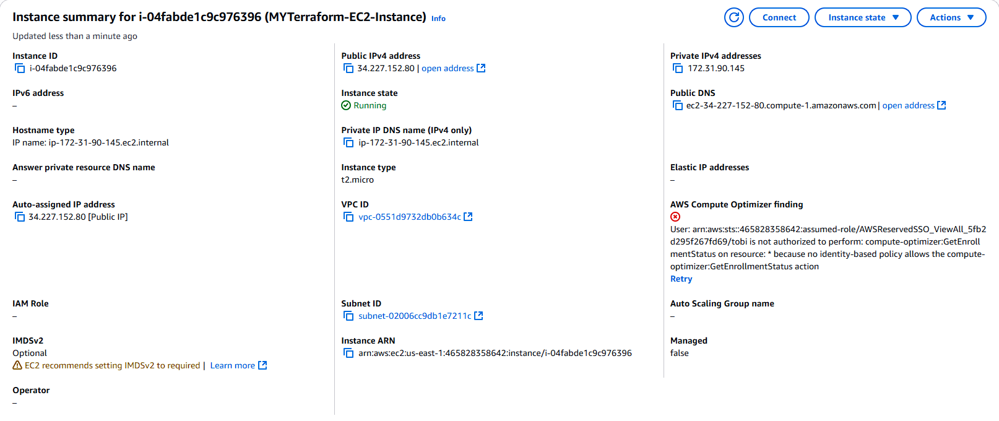
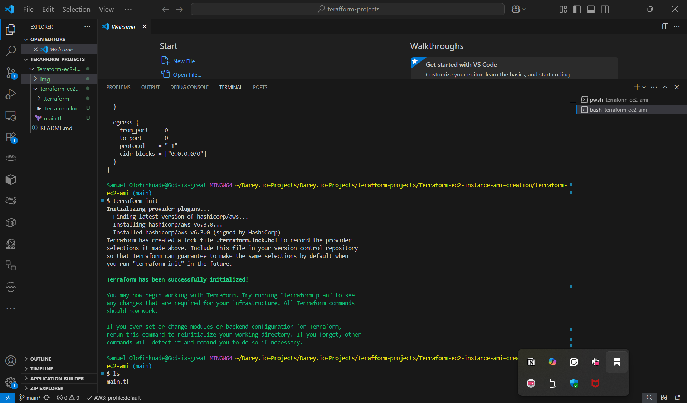
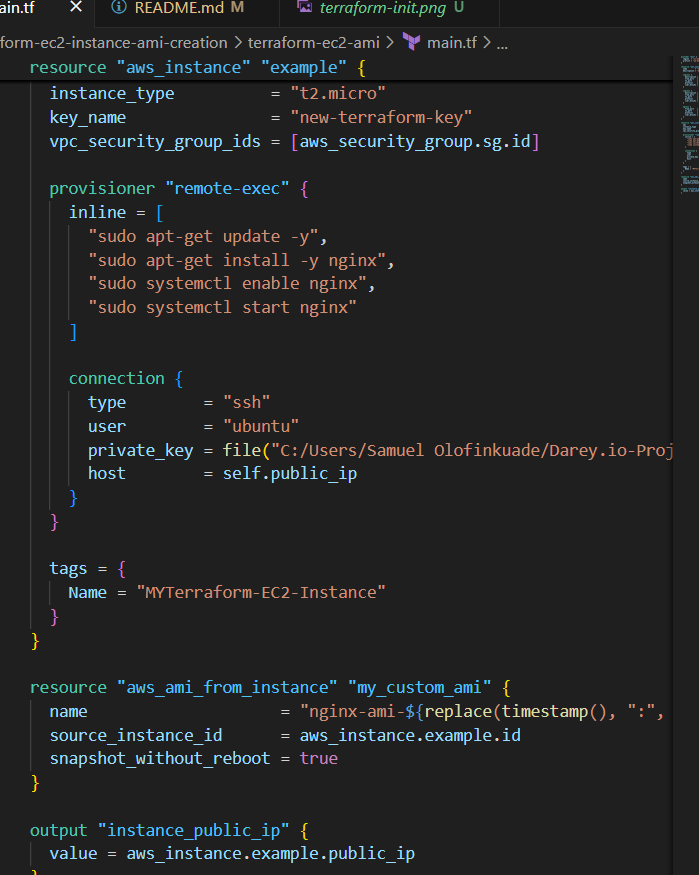
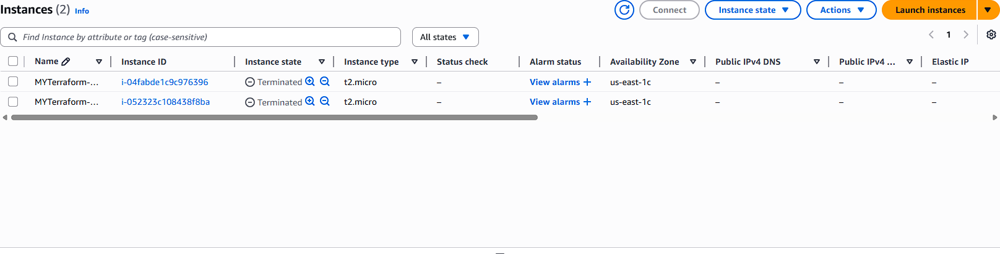
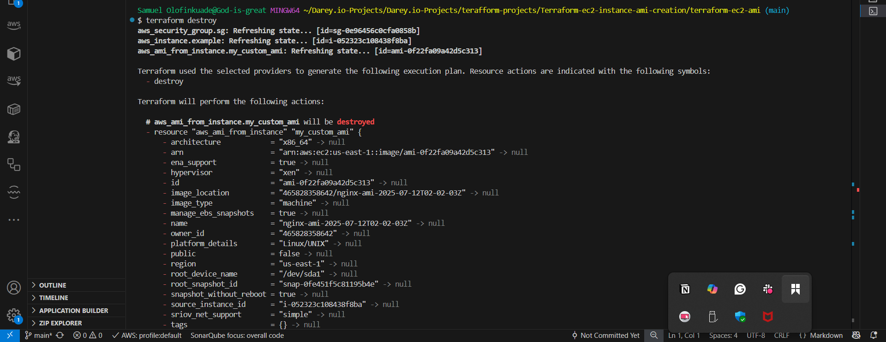

# 🚀 Terraform EC2 Instance & AMI Creation

> GitHub Repository: [https://github.com/Techytobii/Terraform-ec2-instance-ami-creation.git](https://github.com/yourusername/your-repo-name)

---

## 🎯 Project Objectives

✅ Automate deployment of an EC2 instance in AWS using Terraform  
✅ Secure instance with Security Groups  
✅ Install Nginx via Terraform provisioners  
✅ Optionally create a reusable AMI from the configured EC2 instance  
✅ Gain hands-on experience with Terraform end-to-end

---

## 🛠️ Project Prerequisites

Before you start, ensure you have:

- [Terraform](https://developer.hashicorp.com/terraform/downloads) installed
- An AWS Account
- AWS credentials configured either:
  - via environment variables
  - or via an AWS profile, e.g.:
    ```bash
    aws configure --profile my-dev-profile
    ```
- A pre-existing AWS EC2 Key Pair:
````

new-terraform-key

```
- Your PEM file saved locally:
```

new-terraform-key.pem

```

---

## ⚙️ Project Structure

```

.
├── main.tf
├── README.md
├── images/           # Store screenshots here
└── new-terraform-key.pem

````

---

## 🔑 SSH Key Setup (Windows)

- Place your `.pem` file (e.g. `new-terraform-key.pem`) in your project directory
- Fix permissions (Windows PowerShell):

    ```powershell
    icacls new-terraform-key.pem /inheritance:r /grant:r "${env:USERNAME}:(R)"
    ```

- Update your Terraform configuration to use the **absolute path**:

    ```hcl
    private_key = file("C:/path/to/new-terraform-key.pem")
    ```

---

## 🖼️ Screenshots

### ✅ Terraform Apply Output






---

### ✅ Nginx Welcome Page



---

### ✅ AWS Console - EC2 Instance




---

## 🚀 Deployment Steps

### 1. Initialize Terraform

```bash
terraform init
````



---

### 2. Apply the Terraform Configuration

```bash
terraform apply
```


When prompted, type:

```
yes
```

---

### 3. Retrieve EC2 Public IP

After applying, Terraform outputs:

```
Outputs:

instance_public_ip = "54.197.39.227"
```

---

### 4. Test Nginx in Browser

Open:

```
http://<instance_public_ip>
```

You should see the **Nginx welcome page**.


---

### 5. SSH Into EC2 Instance (Optional)

```bash
ssh -i "C:/path/to/new-terraform-key.pem" ubuntu@<instance_public_ip>
```

---

### 6. Create a Custom AMI (Optional)

To save the EC2 instance as an AMI:

1. Add this block to your `main.tf`:

   ```hcl
   resource "aws_ami_from_instance" "my_custom_ami" {
     name                    = "nginx-ami-${timestamp()}"
     source_instance_id      = aws_instance.example.id
     snapshot_without_reboot = true
   }
   ```

   

2. Run:

   ```bash
   terraform apply
   ```

Terraform will output a new AMI ID.


---

### 7. Destroy Resources

To avoid AWS charges:

```bash
terraform destroy
```

Type `yes` when prompted.

---






## ⚠️ Challenges Faced

| Challenge                         | Solution                                                                           |
| --------------------------------- | ---------------------------------------------------------------------------------- |
| 🔴 **Windows path syntax errors** | Used forward slashes `/` instead of backslashes `\` in file paths.                 |
| 🔴 **PEM file not found**         | Verified file path, confirmed existence via PowerShell `dir` command.              |
| 🔴 **Expired AWS credentials**    | Ran `aws sso login` or refreshed IAM user credentials.                             |
| 🔴 **SSH connection errors**      | Opened Security Group port 22, ensured correct username (`ubuntu`) for Ubuntu AMI. |

---

## 💻 Sample `main.tf`

Here’s the working Terraform configuration for this project:

```hcl
provider "aws" {
  region  = "us-east-1"
  profile = "my-dev-profile"
}

resource "aws_security_group" "sg" {
  name        = "terraform-sg"
  description = "Allow SSH and HTTP"

  ingress {
    description = "SSH"
    from_port   = 22
    to_port     = 22
    protocol    = "tcp"
    cidr_blocks = ["45.222.100.190/32"]
  }

  ingress {
    description = "HTTP"
    from_port   = 80
    to_port     = 80
    protocol    = "tcp"
    cidr_blocks = ["45.222.100.190/32"]
  }

  egress {
    from_port   = 0
    to_port     = 0
    protocol    = "-1"
    cidr_blocks = ["0.0.0.0/0"]
  }
}

resource "aws_instance" "example" {
  ami                    = "ami-053b0d53c279acc90" # Ubuntu Server 22.04 LTS (us-east-1)
  instance_type          = "t2.micro"
  key_name               = "new-terraform-key"
  vpc_security_group_ids = [aws_security_group.sg.id]

  provisioner "remote-exec" {
    inline = [
      "sudo apt-get update -y",
      "sudo apt-get install -y nginx",
      "sudo systemctl enable nginx",
      "sudo systemctl start nginx"
    ]

    connection {
      type        = "ssh"
      user        = "ubuntu"
      private_key = file("C:/Users/Samuel Olofinkuade/Darey.io-Projects/Darey.io-Projects/terafform-projects/Terraform-ec2-instance-ami-creation/new-terraform-key.pem")
      host        = self.public_ip
    }
  }

  tags = {
    Name = "MYTerraform-EC2-Instance"
  }
}

output "instance_public_ip" {
  value = aws_instance.example.public_ip
}
```

---

## ✅ Outcomes

✅ EC2 instance created via Terraform
✅ Nginx installed and accessible
✅ Optional AMI creation tested
✅ Troubleshooting skills improved

---

---

## 🤝 Contributing

Pull requests welcome! Open an issue or fork the repo to propose changes.

---