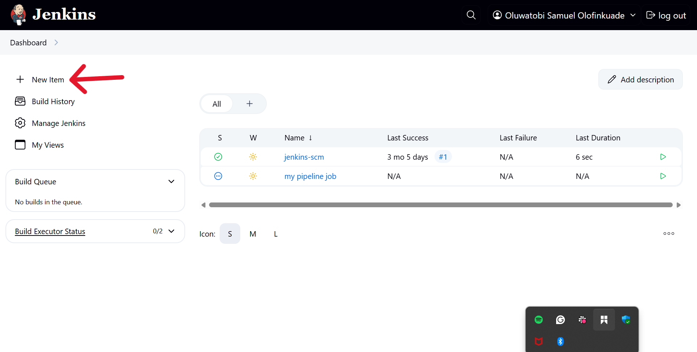
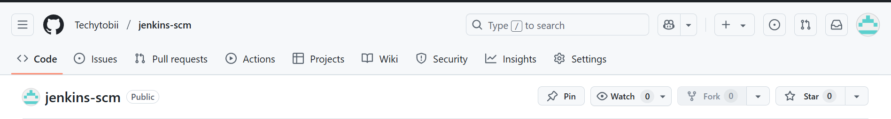
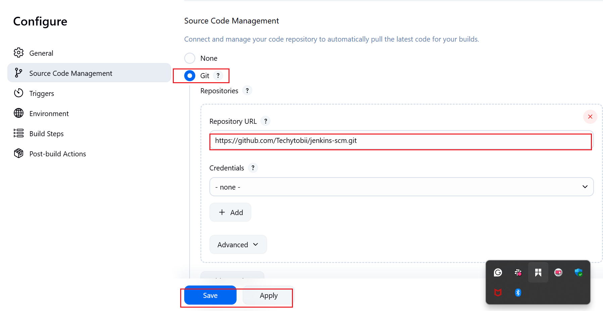
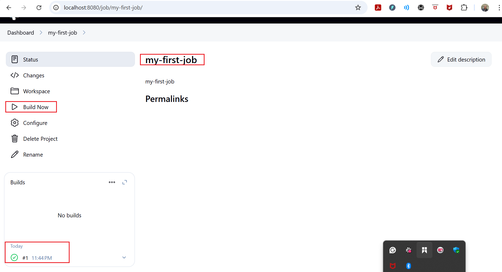
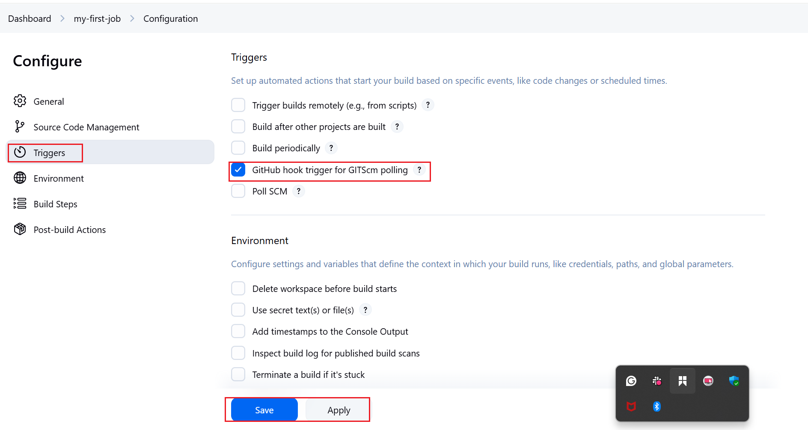
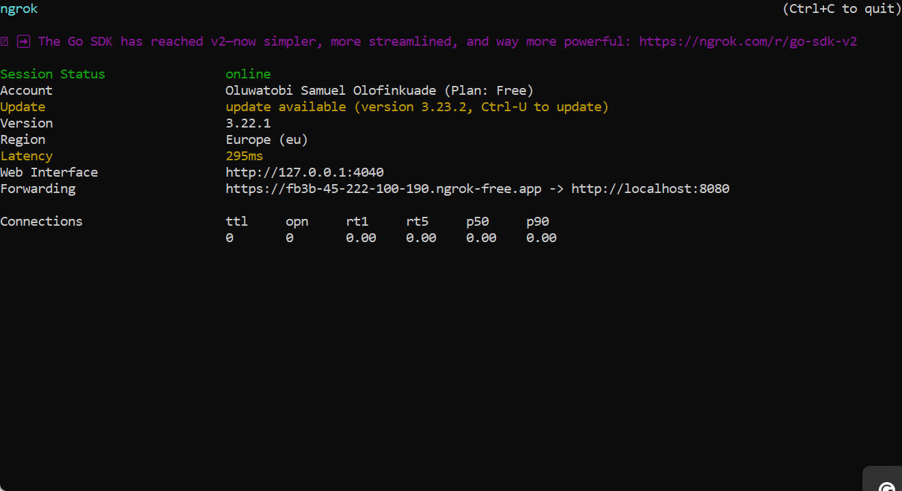
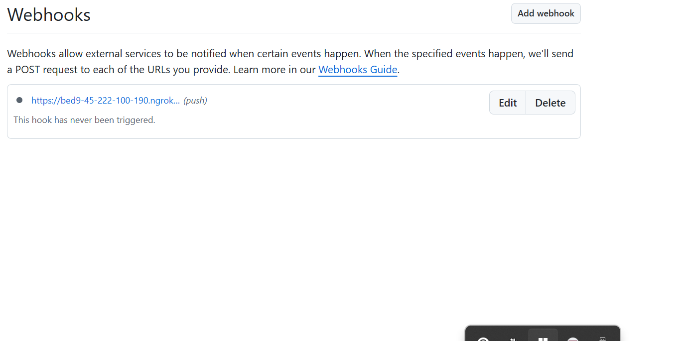
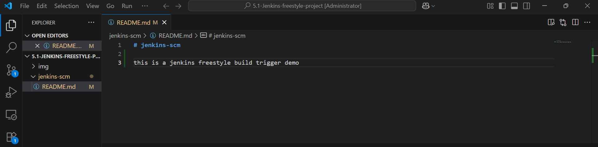
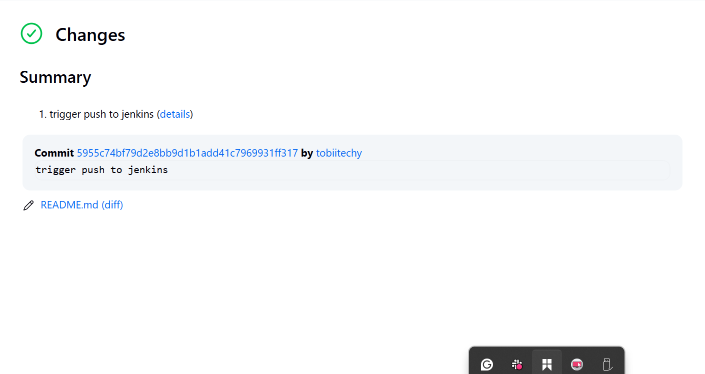

# JENKINS FREESTYLE PROJECT

### PROJECT OBJECTIVES 

1. Automate Build Processes:
Set up automated builds for your application or codebase using Jenkins' Freestyle project.

2. Continuous Integration:
Integrate code from multiple developers and ensure that new changes do not break the build.

3. Automated Testing:
Configure the project to run unit tests or other automated tests after each build.

4. Code Quality Checks:
Integrate tools for static code analysis or linting to maintain code quality.

5. Artifact Archiving:
Archive build artifacts (e.g., JAR, WAR, ZIP files) for future deployment or reference.

6. Notification and Reporting:
Set up notifications (email, Slack, etc.) to alert team members of build status and failures.

7. Deployment Automation:
Optionally, automate deployment to test or production environments after successful builds.

8. Parameterization:
Allow builds to be triggered with different parameters for flexibility (e.g., environment, version).

9. Version Control Integration:
Connect the project to a version control system (e.g., Git, SVN) for source code management.

10. Scheduling:
Schedule builds to run at specific times or trigger them based on events (e.g., code commits).


## CREATING A FREESTYLE PROJECT

>> Created my first build

i. Clicked on new item on the left side of the dashboard menu.


ii. Created a freestyle project and named it "my-first-job"


>> Connected Jenkins to our Source Code Management

Now that the freestyle project has been created let's get it connected with Github

i. Created a repository in Github and named it "jenkins-scm" with a README.md file in it.



ii. Connected Jenkins to Jenkins-scm repository by pasting its url into the selected area s shown below.



iii. Saved the configuration and ran a build now that connected Jenkins to our jenkins-scm repository as shown below



The above shoes that Jenkins is now connected with the Jenkins-scm repository


>> Configured the Build Trigger 

1. Click on **Configure** in the freestyle project dashboard.
2. Go to **Build Triggers** and insert the following configuration:
   
3. Create a GitHub webhook using Jenkins IP address and port:
   - Use ngrok to expose Jenkins:
     ```
     ngrok http 8080
     ```
     
   - Paste the generated URL into the GitHub webhook settings and save.
     

Now the settings have been modiified and ready for automation

>> Changes were made to README.md file in the repository and shown below.





You will observe from the images that a new build has been launched automatically and changes mae in the repository are shown and recored too.