# INTRODUCTION TO GITHUB ACTIONS AND CI/CD COURSE PROJECT

## Project Title:

**Automating Deployment of an E-Commerce Website using GitHub Actions and Docker**

## Author:

**Samuel Oluwatobi Olofinkuade (Techytobii)**

## Repository:

>> [https://github.com/Techytobii/introduction-to-ci-cd](https://github.com/Techytobii/introduction-to-ci-cd)

---

## 🎯 Project Objectives / Deliverables

1. **Develop a Dockerized Node.js Application** for demonstration of CI/CD lifecycle.
2. **Set up version control and code hosting** using Git and GitHub.
3. **Create a Dockerfile** for building application containers.
4. **Configure GitHub Actions workflows** to automate build and test processes.
5. **Publish Docker images** to GitHub Container Registry (GHCR).
6. **Provision and configure two AWS EC2 instances** (main and recovery) as production and rescue hosts.
7. **Securely set up SSH keys and GitHub Secrets** for deployment access.
8. **Automate deployment of new code changes** to the EC2 instance using GitHub Actions.
9. **Demonstrate successful deployment** by accessing application via public IP.
10. **Document the full CI/CD process** with step-by-step instructions, code, challenges, and screenshots.

---

## Part A: Local Development, Containerization, and Image Publishing (Step-by-Step)

### 1. Project Overview

This project demonstrates a complete end-to-end CI/CD pipeline using GitHub Actions, Docker, GitHub Container Registry (GHCR), and an EC2 instance. The pipeline automates the build, test, packaging, and deployment of a Node.js web application.

---

### 2. Tools and Technologies

* Git & GitHub
* GitHub Actions
* Docker
* GitHub Container Registry (GHCR)
* AWS EC2 (Ubuntu)
* SSH

---

#### Step 1: Initialized a Github Repository

* Created a new repository on Github

* 📸 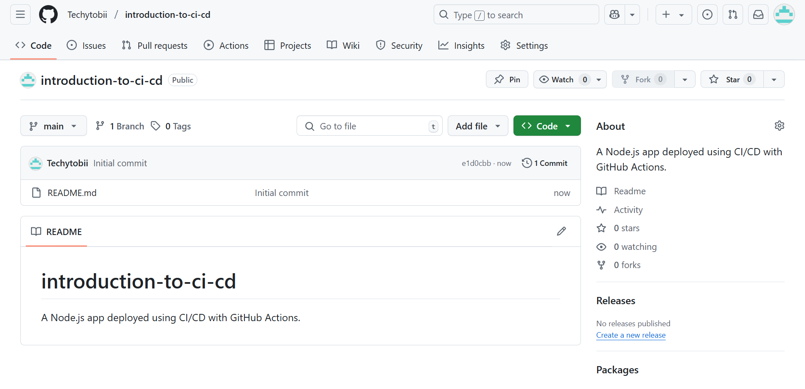


* Cloned it into the local machine
* 📸 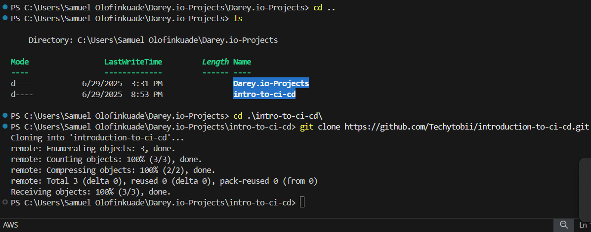


#### Step 2: Initialize Node.js Application

* Created files: `app.js`, `index.js`, `package.json`

* 📸 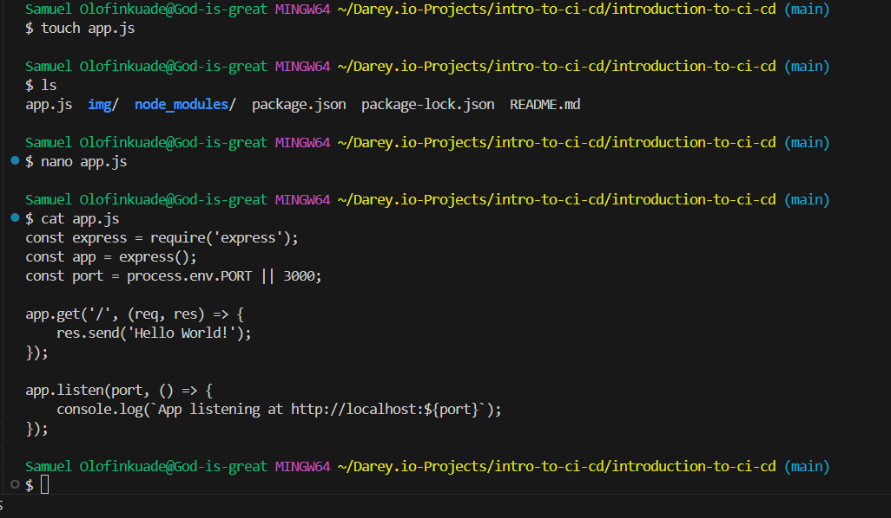

```
{
 "name": "intro-to-ci-cd",
  "version": "1.0.0",
  "main": "index.js",
 "scripts": {
  "start": "node index.js",
  "test": "echo \"No tests yet\" && exit 0"
},
  "keywords": [],
  "author": "",
  "license": "ISC",
  "description": "",
  "dependencies": {
    "express": "^4.18.2"
  },
  "repository": {
    "type": "git",
    "url": "https://github.com/Techtobii/introduction-to-ci-cd.git"
  },
  "devDependencies": {
    "jest": "^30.0.3",
    "supertest": "^7.1.1"
  }

```

* Index.js
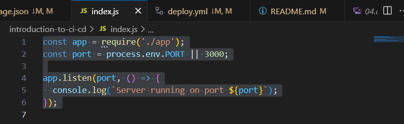

```
const app = require('./app');
const port = process.env.PORT || 3000;

app.listen(port, () => {
  console.log(`Server running on port ${port}`);
});
```


* Package.js
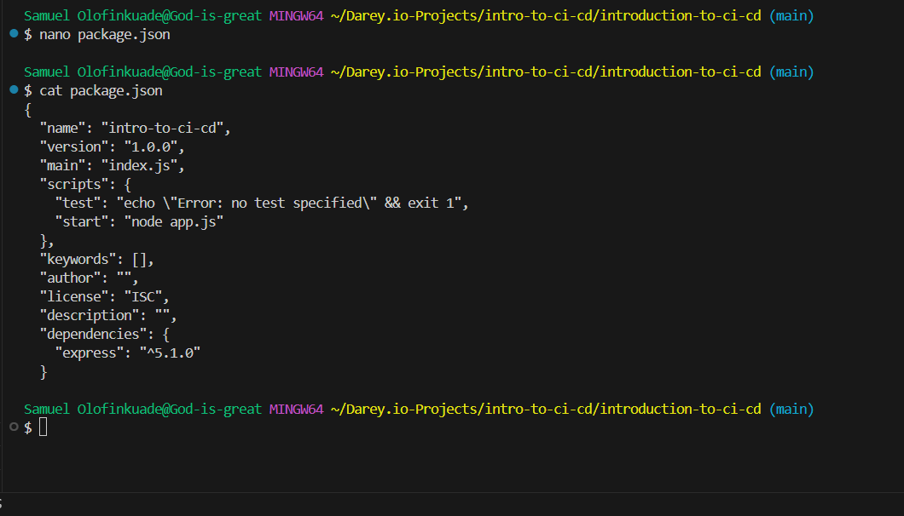

```
{
  "name": "intro-to-ci-cd",
  "version": "1.0.0",
  "main": "index.js",
 "scripts": {
  "start": "node index.js",
  "test": "echo \"No tests yet\" && exit 0"
},
  "keywords": [],
  "author": "",
  "license": "ISC",
  "description": "",
  "dependencies": {
    "express": "^4.18.2"
  },
  "repository": {
    "type": "git",
    "url": "https://github.com/Techtobii/introduction-to-ci-cd.git"
  },
  "devDependencies": {
    "jest": "^30.0.3",
    "supertest": "^7.1.1"
  }
}
```


* Installed Express dependency

```bash
npm init -y
npm install express
```

* 📷 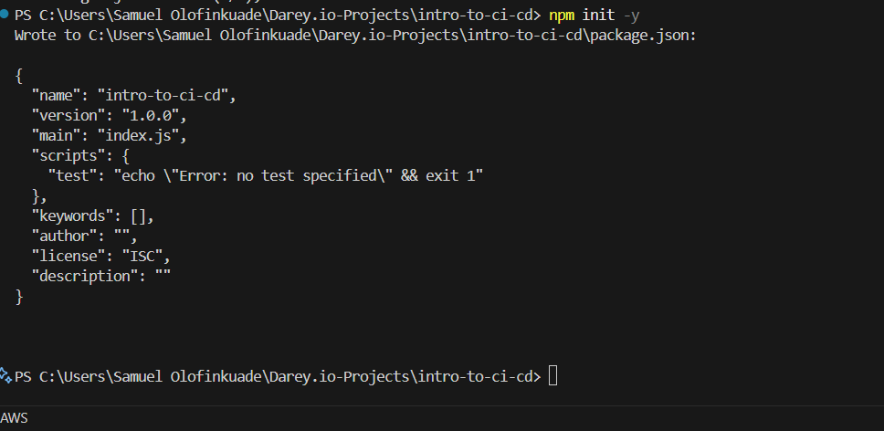

---

#### Step 2: Create Dockerfile

**Dockerfile content:**

```Dockerfile
FROM node:18
WORKDIR /app
COPY package*.json ./
RUN npm install
COPY . .
EXPOSE 3000
CMD ["npm", "start"]
```

* 📷 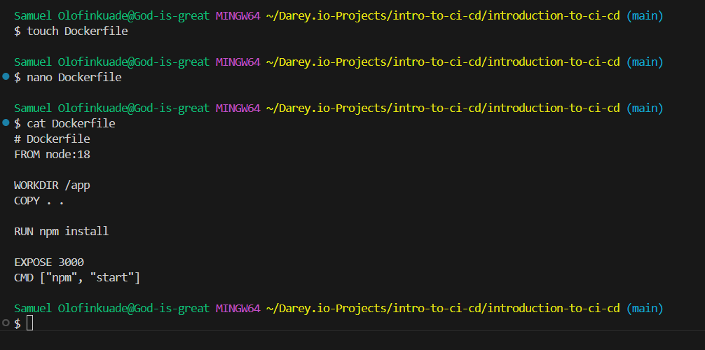


#### Step 3: Build and Run Docker Locally

```bash
docker build -t node-app .
docker run -d -p 80:3000 node-app
```

* 📷 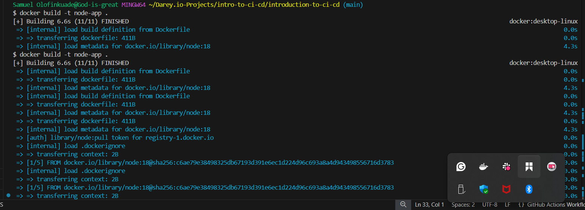

---

#### Step 4: Push to GitHub Repository

* Created repo: `introduction-to-ci-cd`
* Connected local folder to remote and pushed code

```bash
git init
git remote add origin <repo-url>
git add . && git commit -m "initial commit"
git push -u origin main
```

* 📷 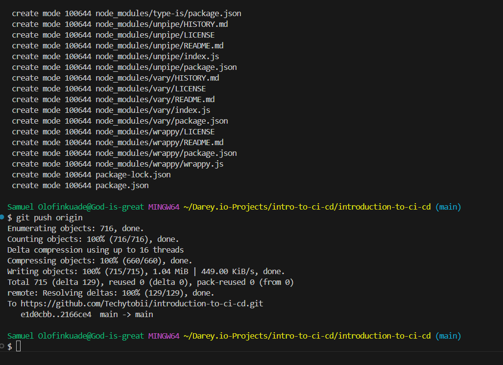

---

#### Step 5: Set Up GitHub Actions Workflow

**Path:** `.github/workflows/deploy.yml`

* 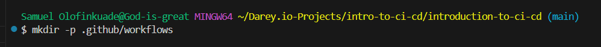


* deploy.yml code

```yaml
name: CI/CD Workflow
on:
  push:
    branches: [main]
jobs:
  build-and-push:
    runs-on: ubuntu-latest
    steps:
      - name: Checkout
        uses: actions/checkout@v4

      - name: Log in to GHCR
        uses: docker/login-action@v3
        with:
          registry: ghcr.io
          username: ${{ github.actor }}
          password: ${{ secrets.GHCR_PAT }}

      - name: Build and push Docker image
        uses: docker/build-push-action@v5
        with:
          context: .
          push: true
          tags: ghcr.io/techytobii/introduction-to-ci-cd:latest
```

* 📷 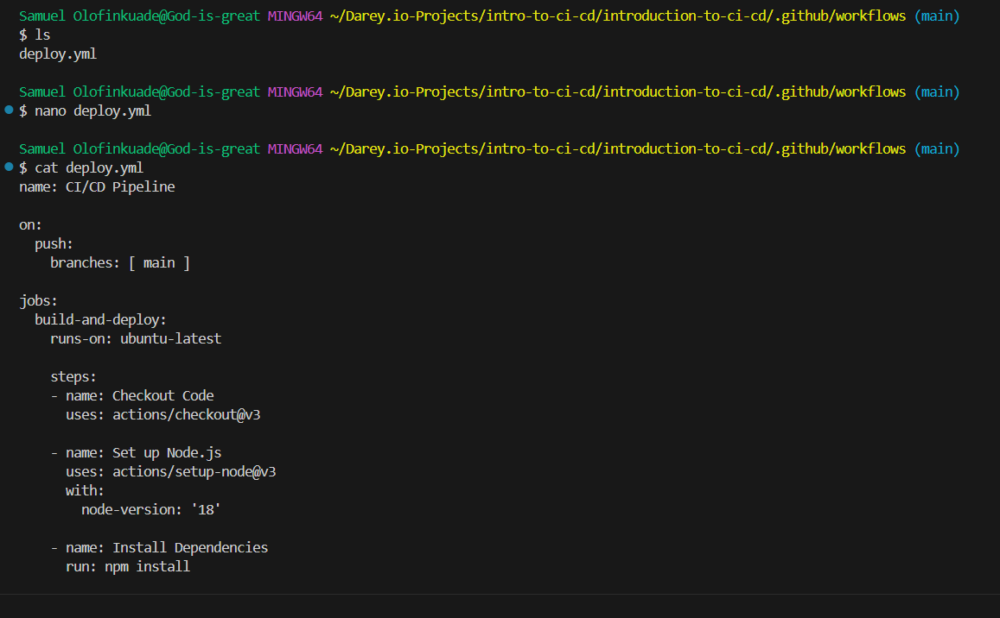


* 📷 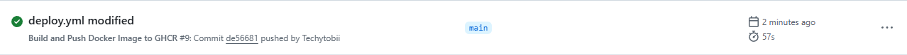


---

### 4. Challenges & Solutions (Part A)

**Challenge 1:** 
GitHub Actions push to GHCR denied

* 📷 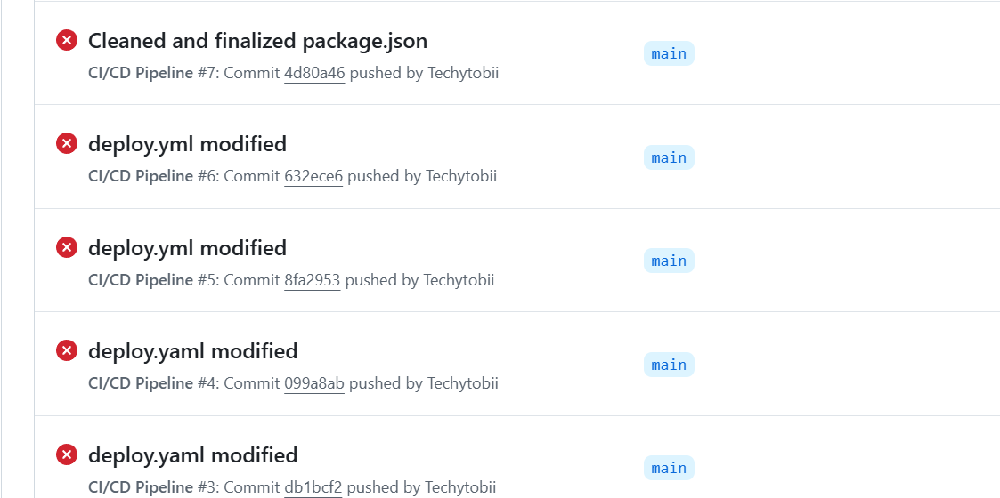

**Solution:** Created and used PAT with `write:packages` scope

**Challenge 2:** GHCR rejected uppercase repo names

* 📷 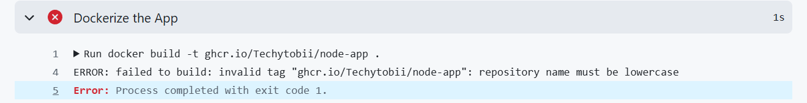

**Solution:** Used lowercase naming in image tag

---

## Part B: Automated Deployment to EC2 (Step-by-Step)

### 1. EC2 Setup (Two Instances)

* Launched **Primary EC2 Instance** (Ubuntu 22.04) for production
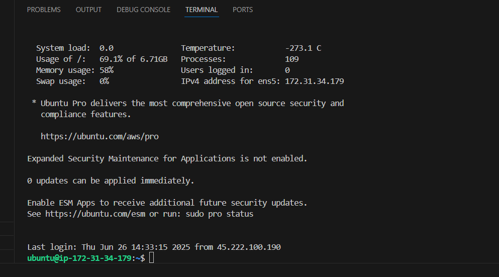

* Launched **Secondary EC2 Instance** for recovery

* Created security groups to allow SSH (port 22) and HTTP (port 80)
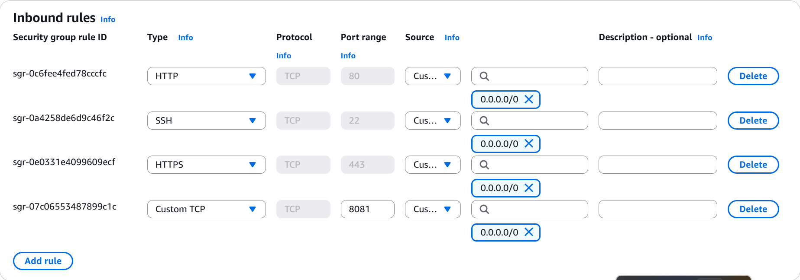


* SSH access tested using `.pem` file


* Installed Docker on both instances

```bash
sudo apt update && sudo apt install docker.io -y
sudo usermod -aG docker ubuntu
```

* 📷 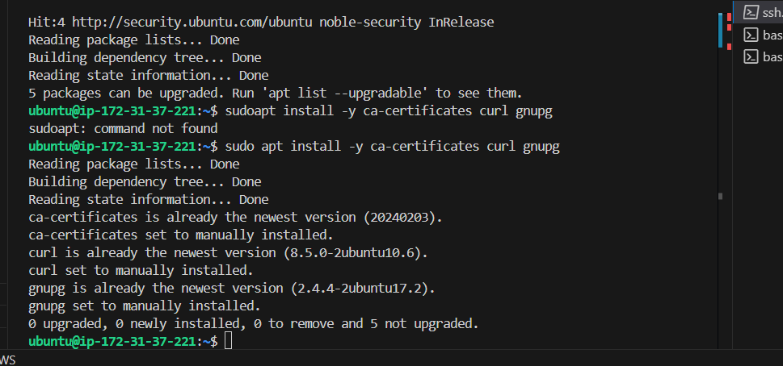


* 📷 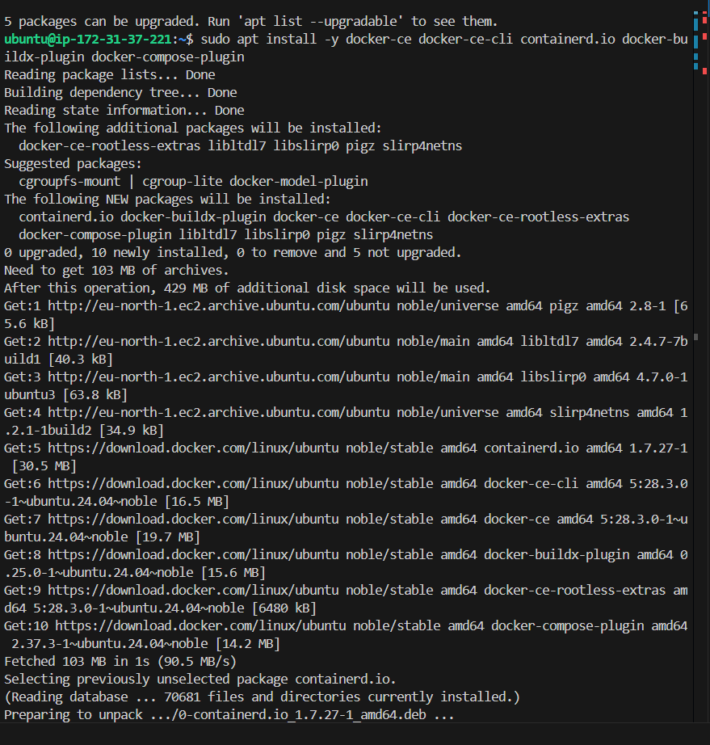

---

### 2. Setup Recovery Access and Data Rescue (when needed)

* When access to primary EC2 was lost, root volume was detached and attached to secondary EC2 as secondary disk
* Used `lsblk` to identify new volume (e.g., `/dev/nvme1n1`)
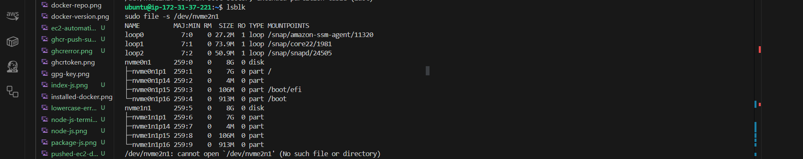


* Mounted volume and copied project files from lost instance

```bash
sudo mkdir /mnt/recovery
sudo mount /dev/nvme1n1p1 /mnt/recovery
sudo cp -r /mnt/recovery/home/ubuntu/introduction-to-ci-cd ~/introduction-to-ci-cd
```

* 📷 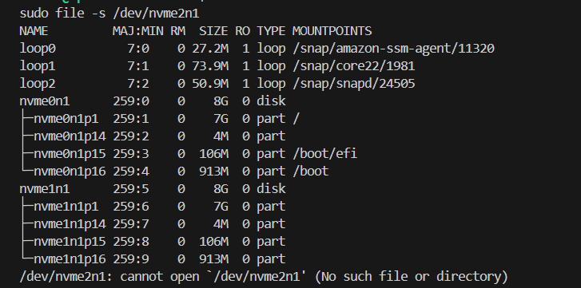

---

### 3. Add GitHub Secrets

| Secret                                                                             | Purpose                         |
| ---------------------------------------------------------------------------------- | ------------------------------- |
| `EC2_SSH_KEY`                                                                      | Private SSH key                 |
| `EC2_HOST`                                                                         | Public IP of EC2                |
| `GHCR_PAT`                                                                         | GitHub Container Registry Token |
|

* 📷 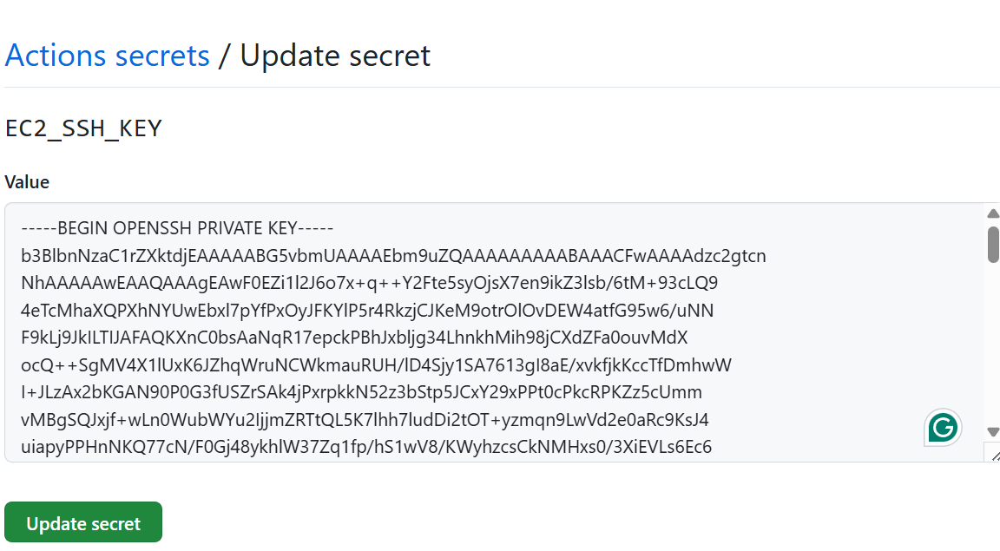 
 
* 📷 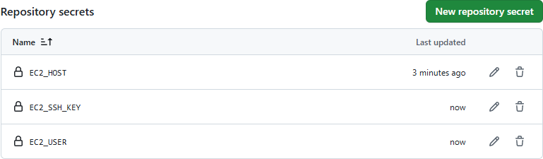
 
* 📷 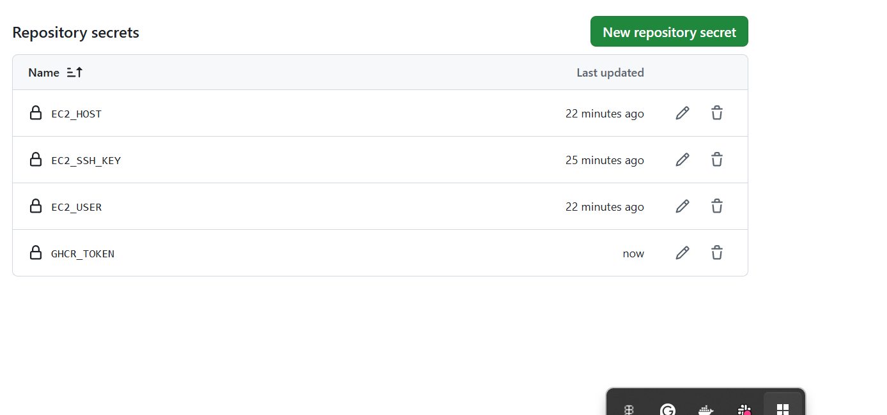                                |

---

### 4. Deployment Workflow in GitHub Actions

**Continued from Part A's workflow:**

```yaml
deploy:
  needs: build-and-push
  runs-on: ubuntu-latest
  steps:
    - name: SSH and Deploy to EC2
      uses: appleboy/ssh-action@v1.0.3
      with:
        host: ${{ secrets.EC2_HOST }}
        username: ubuntu
        key: ${{ secrets.EC2_SSH_KEY }}
        script: |
          docker pull ghcr.io/techytobii/introduction-to-ci-cd:latest
          docker stop node-app || true
          docker rm node-app || true
          docker run -d --name node-app -p 80:3000 ghcr.io/techytobii/introduction-to-ci-cd:latest
```

* 📷 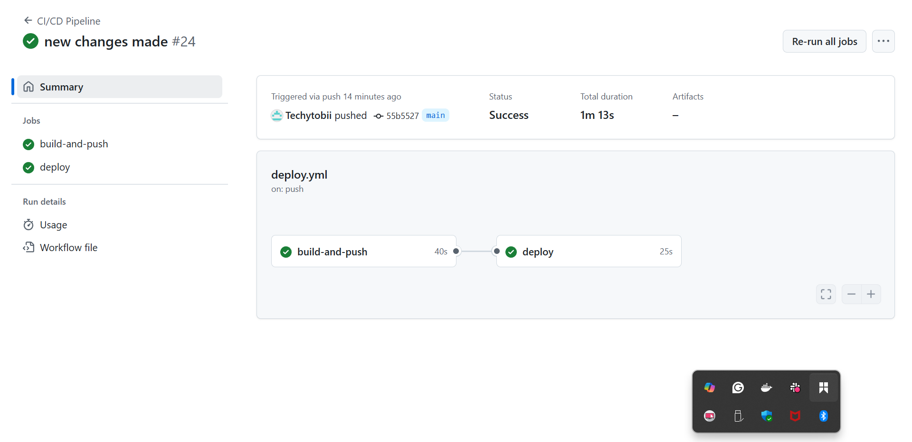

---

### 5. Test Deployment

* Open browser: `http://http://16.170.240.9/`
* Expected message:

> Welcome to Node.js CI/CD!

* 📷 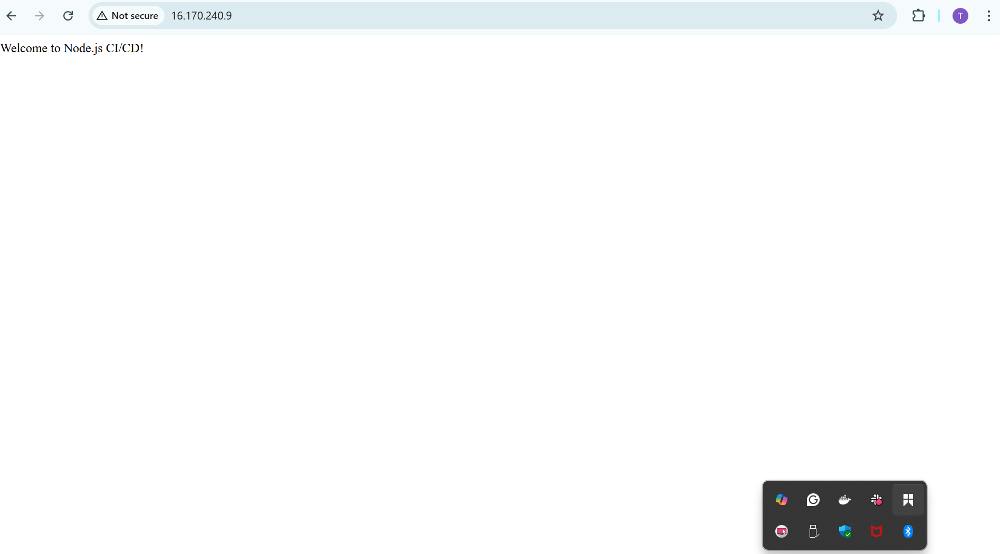

---

### 6. Challenges & Fixes (Part B)

**Challenge 1:** Docker permission error from GitHub Actions SSH


* 📷 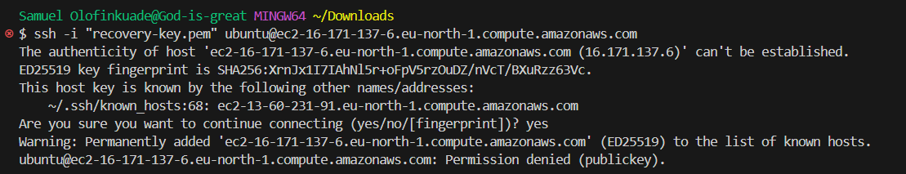

**Fix:** Added EC2 user to Docker group using `sudo usermod -aG docker ubuntu` and rebooted

**Challenge 2:** EC2 SSH access lost after reboot


* 📷 

**Fix:** Used secondary EC2 to recover root volume, mounted disk, and copied project files

---


**Prepared by:** Samuel Oluwatobi Olofinkuade
**Date:** July 1, 2025
