# INTRODUCTION TO JENKINS

Jenkins is a widely adopted open-source tool  designed to streamline and automate various stages of the software development lifecycle. It is especially known for enabling Continuous Integration (CI) and Continuous Delivery (CD) — key methodologies in efficient and reliable software engineering.

## Core Capabilities 

### Plugin Ecosystem: Jenkins offers a large number of plugins, allowing teams to connect it with a broad range of tools for building, testing, and deploying applications.

### Code-Based Pipelines: Development workflows can be scripted and version-controlled using a configuration file, making automation easier to maintain and replicate.

### Scalable Build Execution: Jenkins supports running tasks across multiple machines, distributing workloads to optimize performance and build times.

### Cross-Platform Compatibility: Since it's developed in Java, Jenkins runs on many operating systems and adapts to diverse infrastructure setups.

## Role in Continuous Integration (CI)

Jenkins helps teams automatically test and integrate changes as code is submitted to a shared repository. This reduces manual effort, detects problems early, and promotes a smoother development process.

## Role in Continuous Delivery (CD)

By automating deployments to test and production environments, Jenkins supports frequent and consistent software releases. This reduces the risk of human error and shortens the time between writing code and delivering it to users.

*************************************************

# GETTING STARTED WITH JENKINS

>> SSH INTO TERMINAL

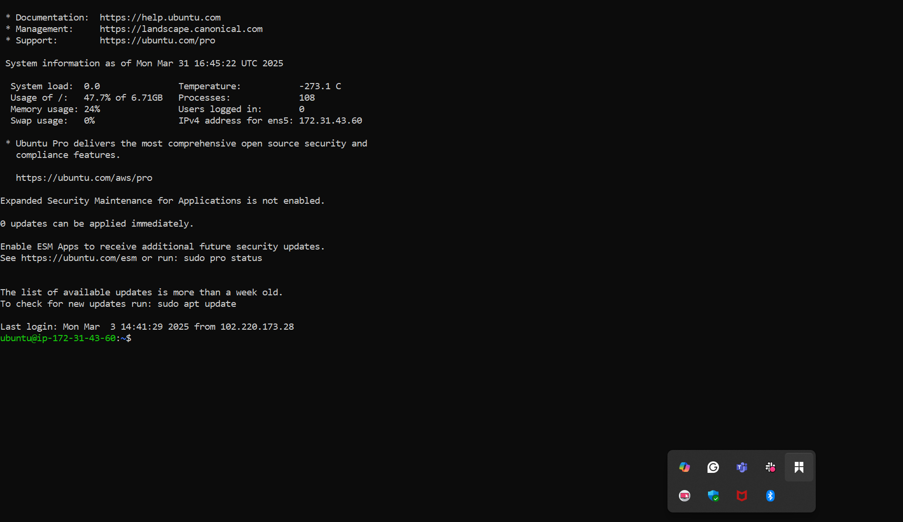

>> UPDATED AND UPGRADED PACKAGE REPOSITORIES

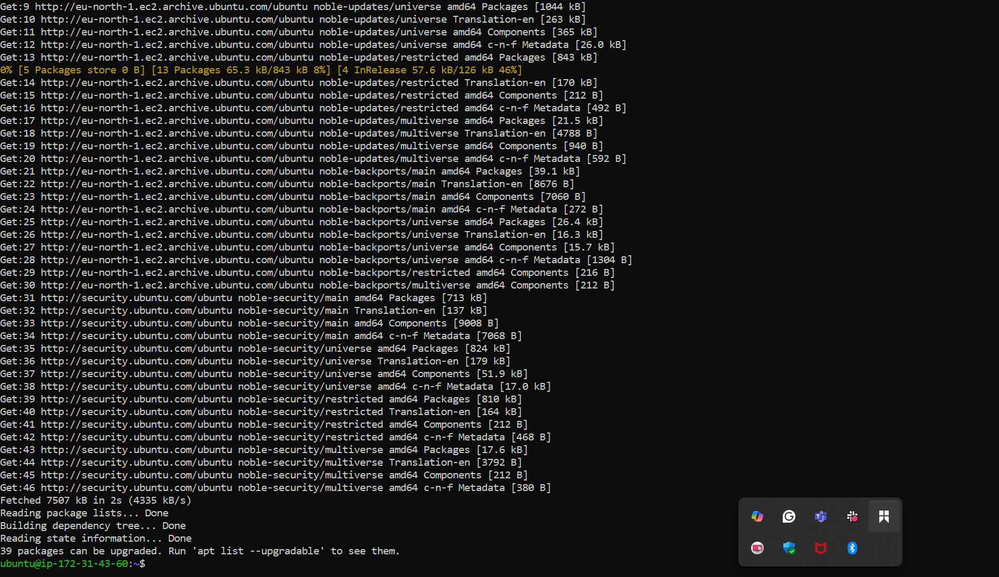

>> INSTALLED JDK

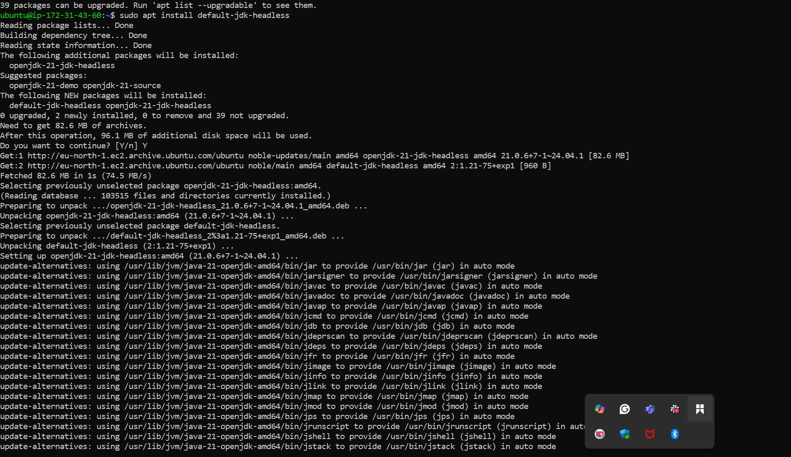

>> INSTALLED JENKINS

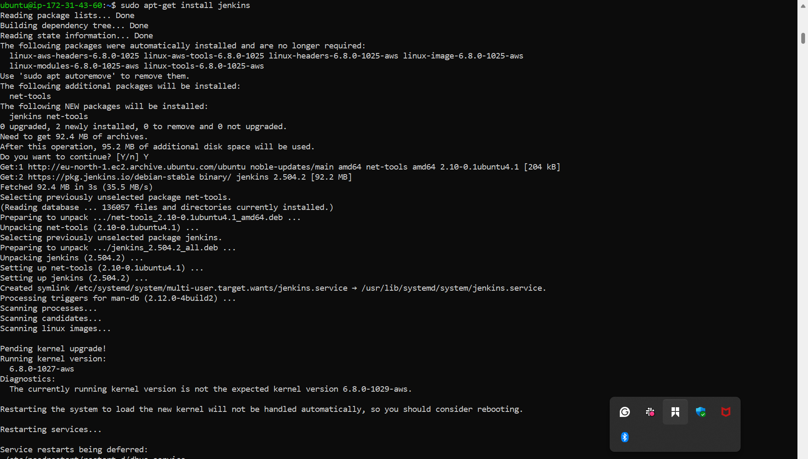

>> ADDED JENKINS REPOSITORY 

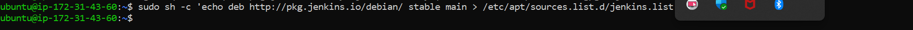

>> ADDED JENKINS KEY

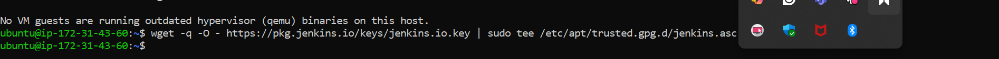

>> THEN ADDED JENKINS OFFICIALLY

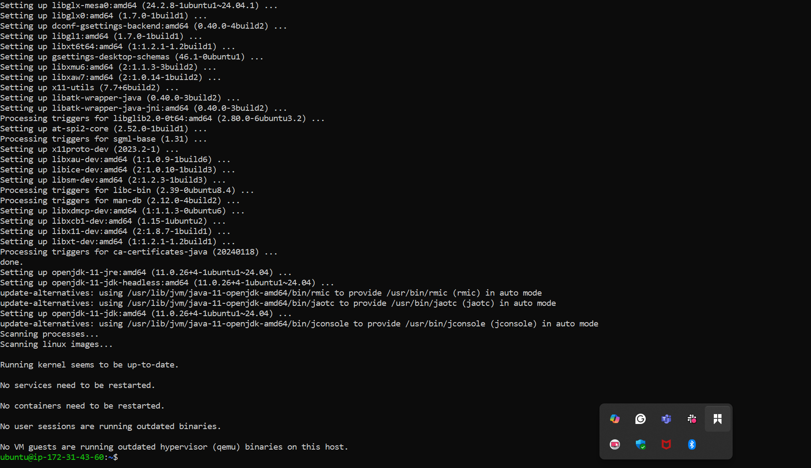

>> CHECKED IF JENKINS INSTALLED, UP AND RUNNING 

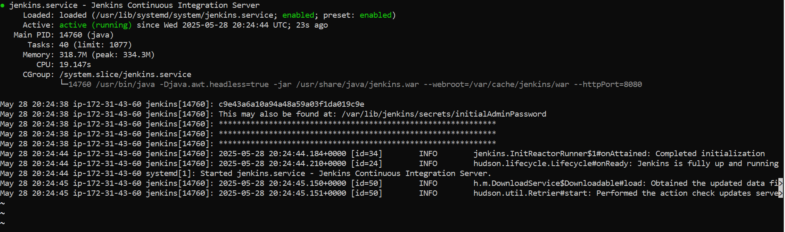

>> CREATED NEW INBOUND RULES FOR PORT 8080 IN SECURITY GROUP

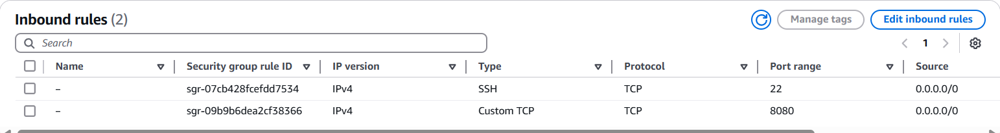

>> I SET UP JENKINS THE WEB CONSOLE, INSTALLED SUGGESTED PLUGINS, CREATED A USER ACCOUNT, AND SUCCESSFULLY LOGGED IN TO JENKINS CONSOLE

************************************************

>>> RAN MY FIRST BUILD, FREESTLYE JOB AND PIPELINE 

 ***************************************************

 > CREATED WEBHOOK ON GITHUB

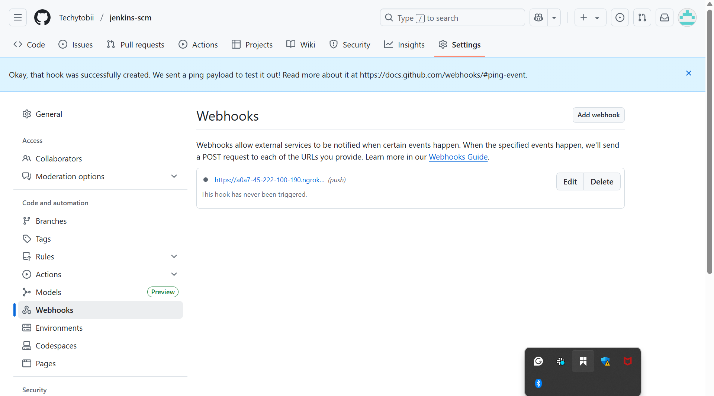

***************************************************

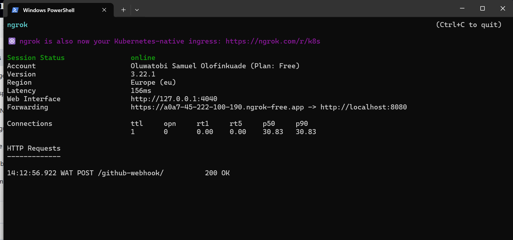

>> MY FIRST BUILD

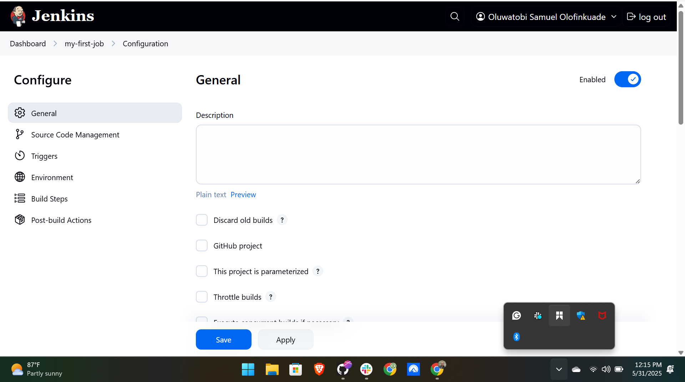

>> MY FIRST BUILD

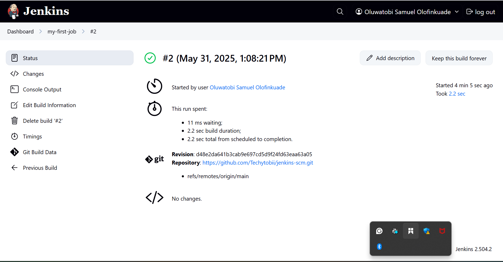

>> JENKINS DASHBOARD AFTER SUCCESSFUL BUILDS 

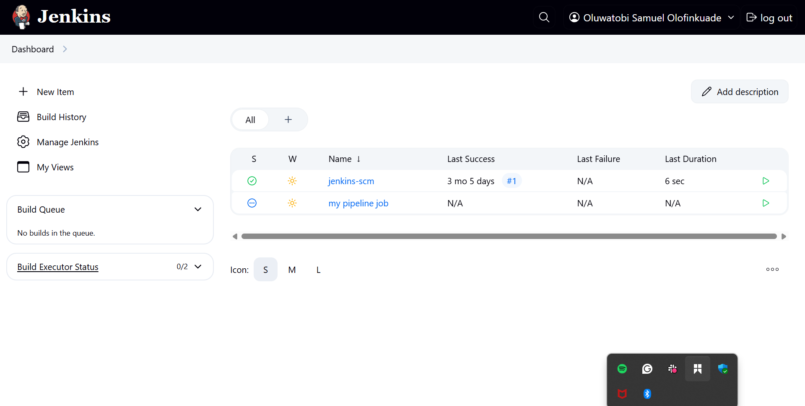

>>>>>>>>>>>>>>>>>>>>>>>>>>>>>>>>>>>>>>>>>>>>>