> CAPSTONE PROJECT-WORDPRESS SITE ON AWS

>> VPC SETUP
I kickstarted my project by creating respective vps as directed in the project instructions, and they are represented in the snapshots below.

1. *

2. *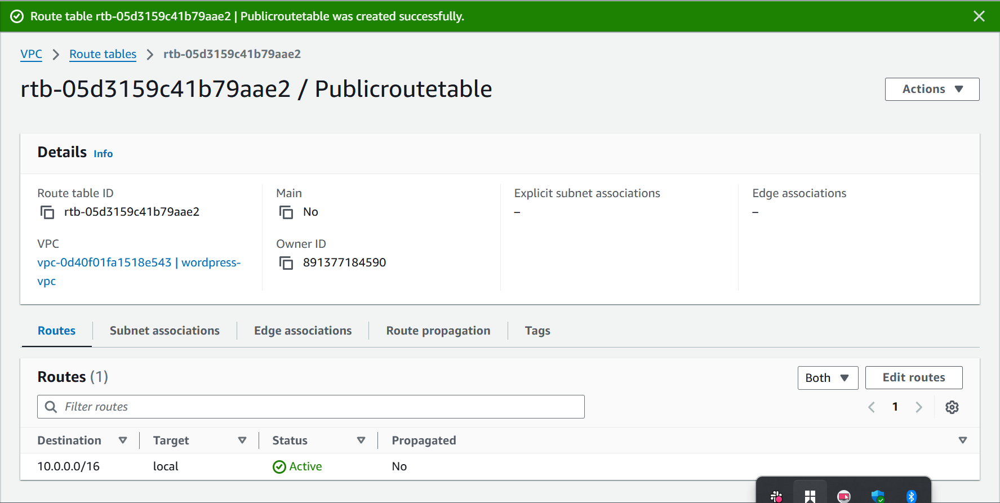

3. *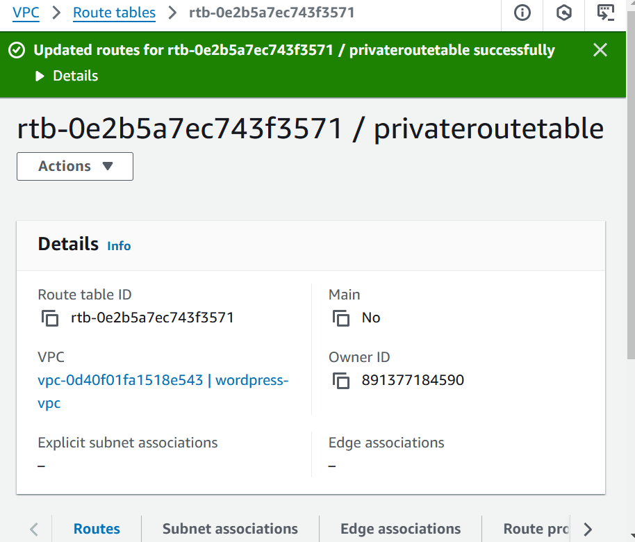

>> PUBLIC AND PRIVATE SUBNET WITH NAT GATEWAY

The following snapshots shows how i created the private and public subnets for the project.

1. *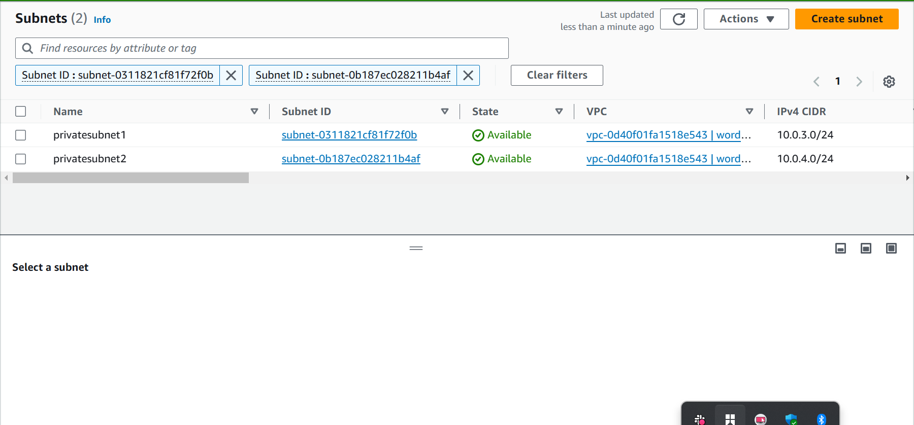

2. *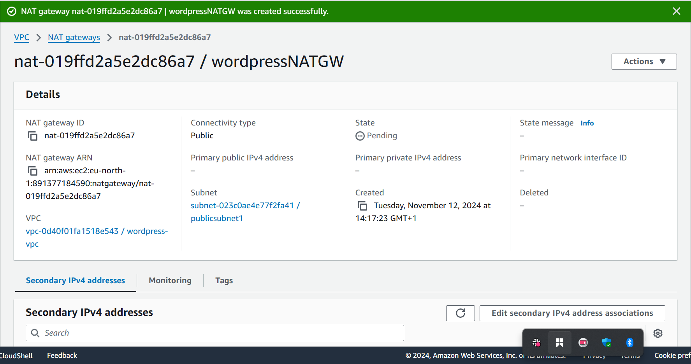

>> AWS MSQL RDS SETUP

I created a RDS database and setup the security group configuration and also the wordpress-rds connection, it is represented in the following snapshots below.

1. *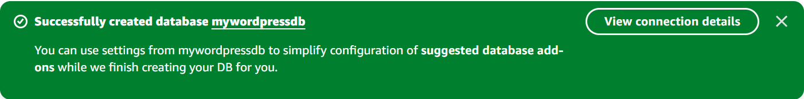

2. *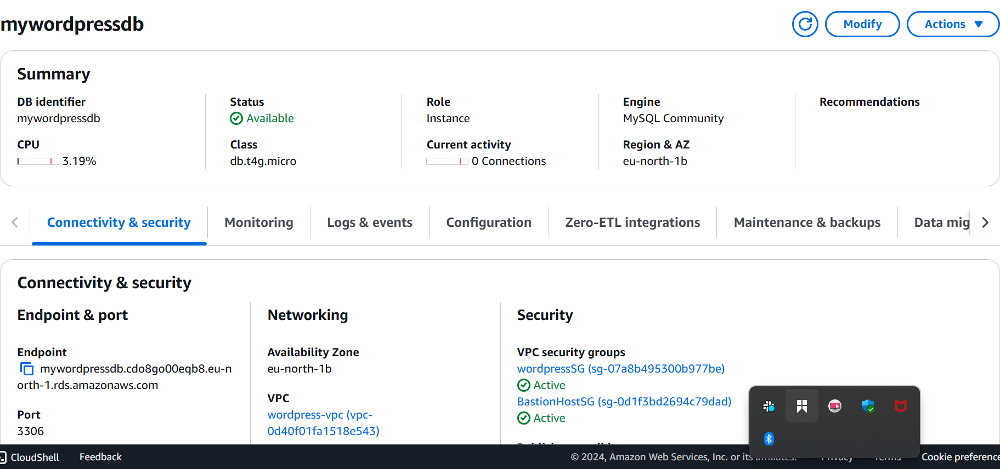

>> EFS SETUP FOR WORDPRESS  FILES

Created an efs file system and successfully mounted it to the wordpress instance and it is represented in the snapshots below.

1. *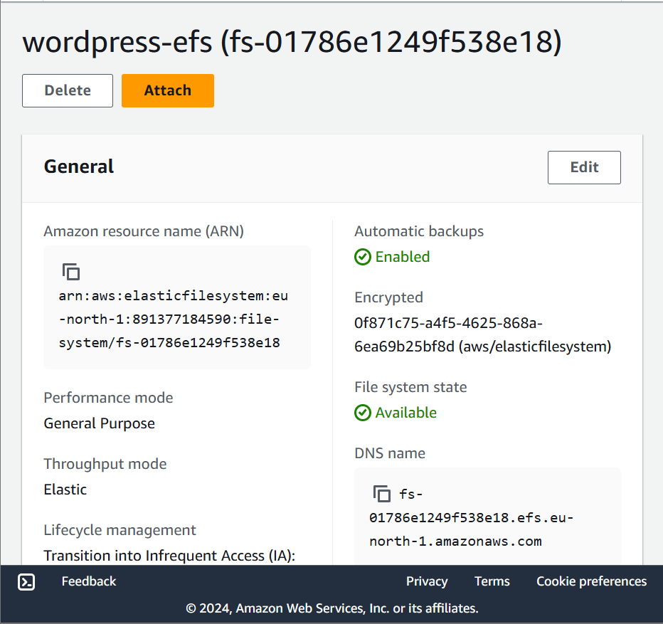

2. *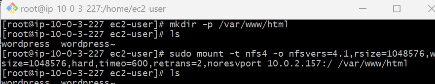

>> WORDPRESS CONFIGURATION

The following snapshots shows ythe steps taken to successfully configure and create a Wordpress site on the terminal

1. first ssh into BastionHost
*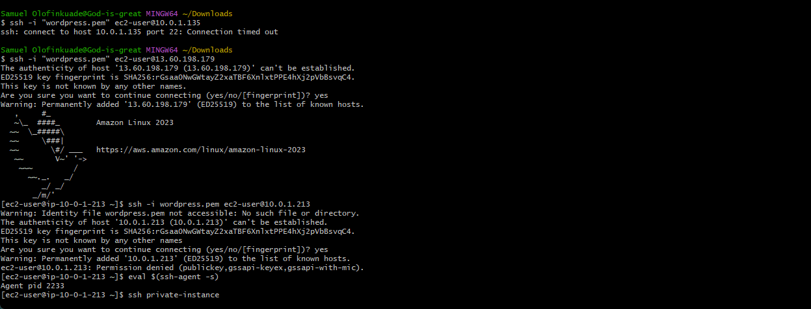

2. then ssh into wordpress private server 
*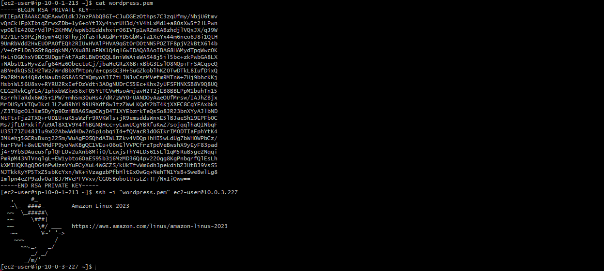

3. install apache 
*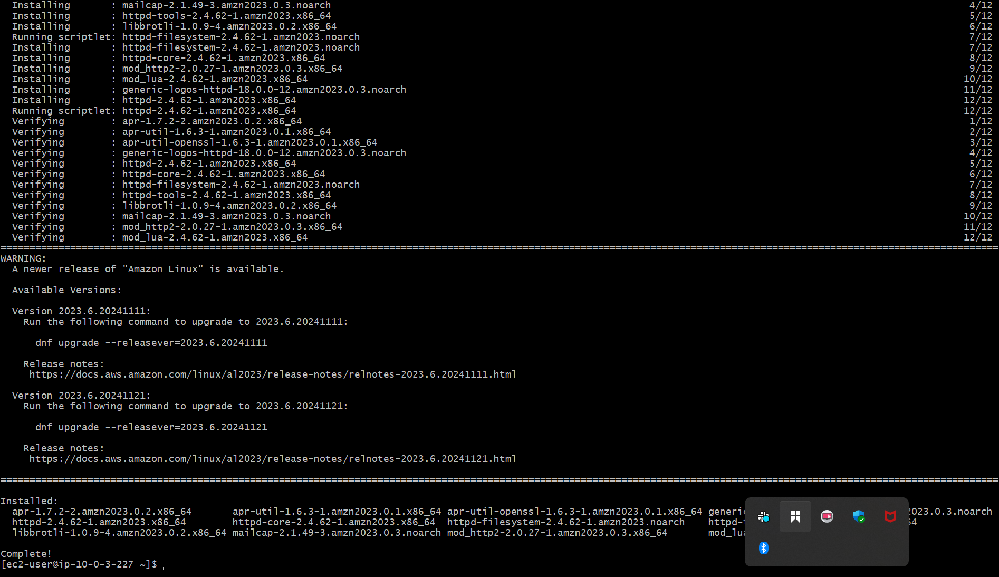

4. install php 7.4
*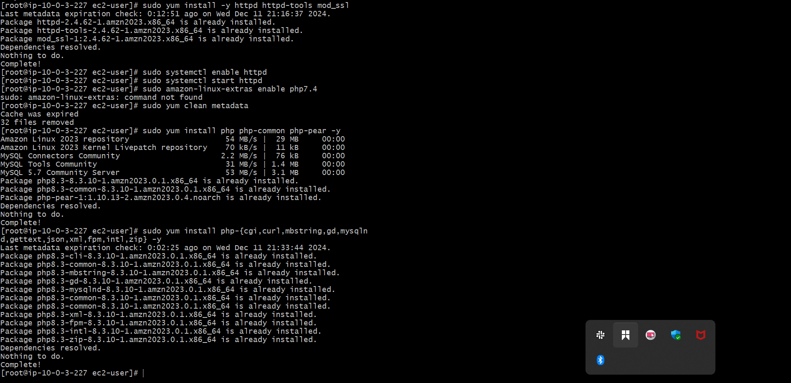

5. install mysql5.7
*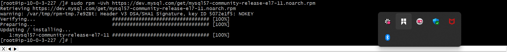

6. sudo yum install mysql-community-server -y
*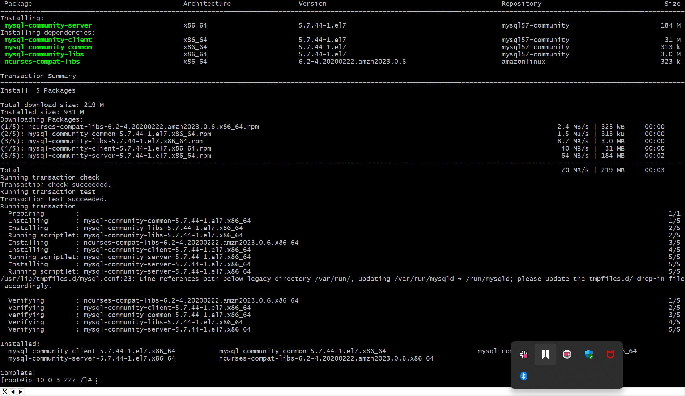

7. set permissions 
*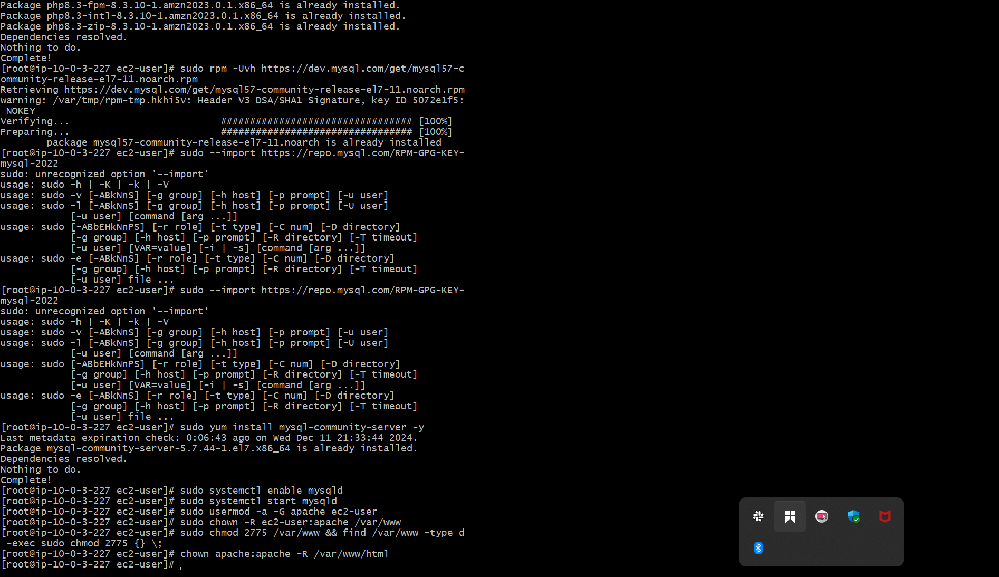

8. Download Wordpress files 
*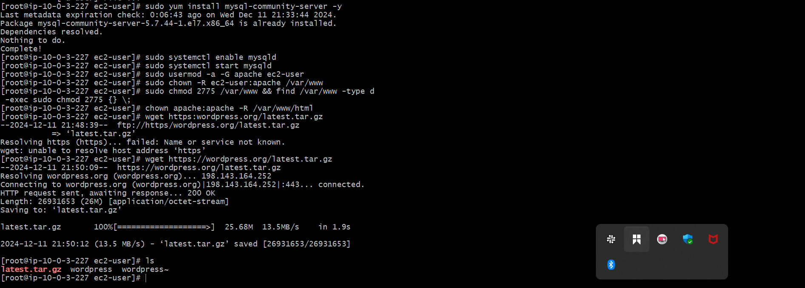

9. create the wp-config.php file
*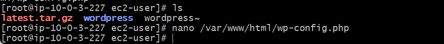

*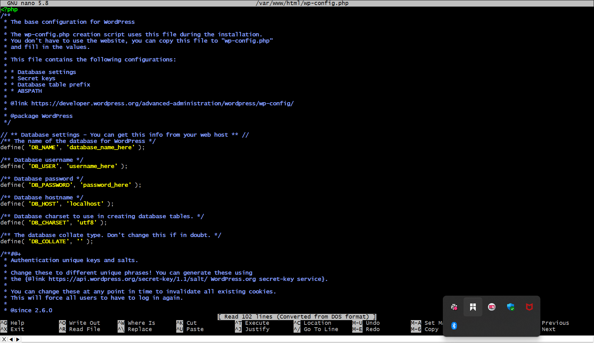

10. Restart the webserver 
*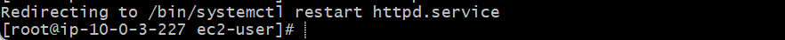

>> BELOW ARE THE CHALLENGES ENCOUNTERED WHILE WORKING ON THIS PROJECT.

I was unable to create an application load balancer and auto scaling group.